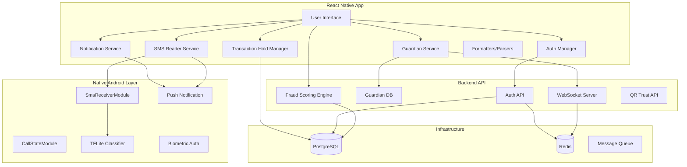

# Design Document: SentinelPay Advanced Features Enhancement

## Overview

This design document specifies the architecture and implementation approach for Phase 9 of SentinelPay, adding seven major feature enhancements: in-app notifications, SMS-based OTP scam detection, guardian approval system, transaction hold mechanism, production deployment infrastructure, JWT-based authentication, and utility parsers/formatters.

### Scope

The enhancements build upon the existing React Native mobile app and FastAPI backend to add:
- **Local push notifications** for transaction confirmations using react-native-push-notification
- **On-device SMS monitoring** using the existing spam_classifier.tflite ML model to detect OTP sharing scams
- **Guardian approval workflow** for high-risk transactions (fraud score > 0.7) with WebSocket/polling fallback
- **Transaction hold period** (10-30s) allowing users to review and cancel suspicious payments
- **Production deployment guides** for AWS EC2 and DigitalOcean with SSL, systemd, and security hardening
- **JWT authentication system** with OTP verification, bcrypt password hashing, and biometric support
- **Parser/formatter utilities** for transaction notifications, guardian messages, and JWT tokens

### Design Principles

1. **Privacy-First**: SMS content MUST remain on-device; ML classification uses local TFLite model
2. **Real-Time Responsiveness**: Notifications within 2s, guardian approvals via WebSocket with 3s polling fallback
3. **Security by Default**: bcrypt (≥12 rounds), JWT with 24h expiration, HTTPS/TLS for production
4. **Atomicity Guarantees**: Database row-level locking for transaction hold to prevent double-spend
5. **Graceful Degradation**: Notification failures must not block transactions; WebSocket failures fall back to polling

### Technology Constraints

- **React Native 0.73.6** (bare workflow) with TypeScript
- **Kotlin 1.9.22** (cannot upgrade to 2.x due to AsyncStorage 1.23.1 compatibility)
- **FastAPI 0.115.0** with Python 3.13
- **PostgreSQL 16** and **Redis** via Docker
- **TensorFlow Lite** for on-device ML inference
- **Emulator development**: API base URL `10.0.2.2:8000`
- **Production deployment**: configurable domain with Let's Encrypt SSL

## Architecture

### System Architecture



### Component Interaction Flow

**1. Transaction Notification Flow**
```
Transaction Complete → Notification Service → Format Message (Parsers)
→ react-native-push-notification → Display on Device
```

**2. SMS Scam Detection Flow**
```
Incoming SMS → SmsReceiverModule (Native) → Extract Content
→ TFLite Classifier (on-device) → Risk Assessment
→ [If SUSPICIOUS/DANGEROUS] → Warning Notification
```

**3. Guardian Approval Flow**
```
High-Risk Transaction (score > 0.7) → Guardian Service
→ WebSocket Push (or HTTP Polling fallback)
→ Guardian Approves/Rejects → Execute/Cancel Transaction
```

**4. Transaction Hold Flow**
```
User Enters PIN → Check Hold Threshold → [If exceeds]
→ Hold State (display countdown + details)
→ User Confirms/Cancels/Timeout → Execute/Cancel with DB Lock
```

**5. Authentication Flow**
```
Register → OTP Verification → Password Hash (bcrypt)
→ Login → JWT Generation → Store in AsyncStorage
→ API Requests → JWT in Authorization Header
→ Backend Validates → Refresh if Expired
```

## Components and Interfaces

### 1. Notification Service

**Purpose**: Send local push notifications for transaction events

**Location**: `SentinelPayApp/src/services/notificationService.ts`

**Dependencies**: 
- `react-native-push-notification` for local notifications
- Transaction data from wallet database
- Message formatter from parsers

**Interface**:
```typescript
interface TransactionNotificationPayload {
  amount: number;
  counterpartyVpa: string;
  status: 'APPROVE' | 'REVIEW' | 'REJECT';
  fraudScore?: number;
  timestamp: Date;
  txnId: string;
}

class NotificationService {
  configure(): void;
  sendTransactionNotification(
    payload: TransactionNotificationPayload,
    recipient: 'sender' | 'receiver'
  ): Promise<void>;
  requestPermissions(): Promise<boolean>;
  handleNotificationAction(action: string, txnId: string): void;
}
```

**Implementation Notes**:
- Must configure notification channel on Android (required for API 26+)
- Use `PendingIntent` for "View Details" action that deep links to TransactionDetailScreen
- Async operation with 2s timeout; log failures without throwing
- Color coding: green (#4ade80) for APPROVE, red (#ef4444) for REJECT, yellow (#fbbf24) for REVIEW
- Icon: use existing `ic_launcher` icon for notifications

---

### 2. SMS Reader Service

**Purpose**: Monitor incoming SMS and detect OTP scam attempts using on-device ML

**Location**: 
- `SentinelPayApp/src/services/smsReaderService.ts` (TypeScript coordinator)
- `SentinelPayApp/android/app/src/main/java/com/sentinelpay/SmsReceiverModule.java` (already exists)
- `SentinelPayApp/android/app/src/main/java/com/sentinelpay/SmsClassifier.java` (already exists)

**Dependencies**:
- `SmsReceiverModule` (native bridge to receive SMS broadcasts)
- `spam_classifier.tflite` model (already in `android/app/src/main/assets/`)
- Notification Service for warnings

**Interface**:
```typescript
interface SmsMessage {
  sender: string;
  body: string;
  timestamp: Date;
}

interface SmsClassificationResult {
  riskLevel: 'SAFE' | 'SUSPICIOUS' | 'DANGEROUS';
  confidence: number;
  containsOtp: boolean;
  isTrustedSender: boolean;
}

class SmsReaderService {
  requestPermissions(): Promise<boolean>;
  startMonitoring(): void;
  stopMonitoring(): void;
  classifyMessage(message: SmsMessage): Promise<SmsClassificationResult>;
  private checkTrustedSender(sender: string): boolean;
  private containsOtpKeywords(body: string): boolean;
}
```

**Implementation Notes**:
- Native module `SmsReceiverModule` already implements BroadcastReceiver for `SMS_RECEIVED`
- `SmsClassifier.java` already loads `spam_classifier.tflite` and provides classification
- TypeScript service layer coordinates: receive SMS → classify → warn if needed
- Trusted sender patterns: `[A-Z]{2}-[A-Z]{6}` (e.g., `AX-HDFCBK`), known bank short codes
- OTP keywords: "OTP", "verification code", "one-time password", "passcode", "PIN"
- Warning notification if: `(containsOtp && !isTrustedSender) || riskLevel !== 'SAFE'`
- All SMS data stays on device; no backend upload

---

### 3. Guardian Service

**Purpose**: Enable guardian approval workflow for high-risk transactions

**Location**: 
- Frontend: `SentinelPayApp/src/services/guardianService.ts`
- Backend: `backend/app/api/v1/guardian.py` (new file)

**Dependencies**:
- WebSocket connection for real-time notifications
- HTTP polling fallback mechanism
- Guardian relationship database table
- Message formatter for approval requests

**Data Model** (Backend):
```sql
CREATE TABLE guardian_relationships (
  id UUID PRIMARY KEY DEFAULT gen_random_uuid(),
  user_id UUID NOT NULL REFERENCES users(id),
  guardian_phone VARCHAR(15),
  guardian_vpa VARCHAR(100),
  status VARCHAR(20) CHECK (status IN ('PENDING', 'ACTIVE', 'REJECTED', 'REMOVED')),
  created_at TIMESTAMP DEFAULT NOW(),
  updated_at TIMESTAMP DEFAULT NOW(),
  CONSTRAINT max_guardians CHECK (
    (SELECT COUNT(*) FROM guardian_relationships WHERE user_id = guardian_relationships.user_id AND status = 'ACTIVE') <= 5
  )
);

CREATE TABLE guardian_approval_requests (
  id UUID PRIMARY KEY DEFAULT gen_random_uuid(),
  transaction_id UUID NOT NULL REFERENCES transactions(id),
  guardian_id UUID NOT NULL REFERENCES guardian_relationships(id),
  amount DECIMAL(10, 2) NOT NULL,
  recipient_vpa VARCHAR(100) NOT NULL,
  fraud_score DECIMAL(3, 2) NOT NULL,
  risk_signals JSONB,
  status VARCHAR(20) CHECK (status IN ('PENDING', 'APPROVED', 'REJECTED', 'EXPIRED')),
  expires_at TIMESTAMP NOT NULL,
  responded_at TIMESTAMP,
  created_at TIMESTAMP DEFAULT NOW()
);
```

**Interface**:
```typescript
interface Guardian {
  id: string;
  phone?: string;
  vpa?: string;
  status: 'PENDING' | 'ACTIVE' | 'REJECTED' | 'REMOVED';
}

interface GuardianApprovalRequest {
  id: string;
  transactionId: string;
  amount: number;
  recipientVpa: string;
  fraudScore: number;
  riskSignals: string[];
  expiresAt: Date;
}

class GuardianService {
  // Guardian management
  addGuardian(phone?: string, vpa?: string): Promise<Guardian>;
  removeGuardian(guardianId: string): Promise<void>;
  listGuardians(): Promise<Guardian[]>;
  acceptInvitation(invitationId: string): Promise<void>;
  
  // Approval workflow
  requestApproval(txn: Transaction): Promise<GuardianApprovalRequest>;
  respondToRequest(requestId: string, decision: 'APPROVE' | 'REJECT'): Promise<void>;
  
  // Communication
  connectWebSocket(): void;
  subscribeToApprovalRequests(callback: (request: GuardianApprovalRequest) => void): void;
  startPolling(): void;
  stopPolling(): void;
}
```

**Implementation Notes**:
- WebSocket endpoint: `ws://<base_url>/api/v1/guardian/ws?user_id=<id>`
- Polling fallback: `GET /api/v1/guardian/pending-requests` every 3 seconds
- 5-minute expiration enforced by backend cron job or event loop
- Backend sends notification via existing Notification Service when approval arrives
- Frontend blocks transaction execution until guardian responds or request expires
- Invitation flow: create relationship with `status=PENDING` → notify guardian → guardian accepts → update to `status=ACTIVE`

---

### 4. Transaction Hold Manager

**Purpose**: Implement configurable hold period with countdown and cancellation

**Location**: `SentinelPayApp/src/services/transactionHoldManager.ts`

**Dependencies**:
- AsyncStorage for hold configuration persistence
- Database transaction locking (PostgreSQL row-level locks)
- Timer management for countdown

**Data Model** (AsyncStorage):
```typescript
interface HoldConfiguration {
  enabled: boolean;
  durationSeconds: number; // 10-30
  thresholdAmount: number; // e.g., 5000
}
```

**Interface**:
```typescript
class TransactionHoldManager {
  getConfiguration(): Promise<HoldConfiguration>;
  updateConfiguration(config: Partial<HoldConfiguration>): Promise<void>;
  
  shouldHold(amount: number): Promise<boolean>;
  
  startHold(txn: Transaction): Promise<HoldSession>;
  confirmHold(sessionId: string): Promise<void>;
  cancelHold(sessionId: string): Promise<void>;
}

interface HoldSession {
  id: string;
  transaction: Transaction;
  expiresAt: Date;
  onExpire: () => void;
  onConfirm: () => void;
  onCancel: () => void;
}
```

**Implementation Notes**:
- Hold check before executing payment: `if (amount >= threshold && holdEnabled) → enterHoldState()`
- Display countdown using React state with `setInterval` updating every 100ms
- On confirm: call `executePayment()` immediately
- On cancel or timeout: do nothing (transaction never executed)
- Backend atomicity: use PostgreSQL `SELECT ... FOR UPDATE NOWAIT` when executing payment to prevent race conditions
- Hold configuration stored in AsyncStorage key: `sentinelpay_hold_config`

---

### 5. Authentication System

**Purpose**: JWT-based authentication with OTP verification and biometric support

**Location**:
- Frontend: `SentinelPayApp/src/services/authService.ts`, `SentinelPayApp/src/screens/LoginScreen.tsx`, `RegisterScreen.tsx`
- Backend: `backend/app/api/v1/auth.py` (new file)

**Data Model** (Backend):
```sql
CREATE TABLE users (
  id UUID PRIMARY KEY DEFAULT gen_random_uuid(),
  phone VARCHAR(15) UNIQUE NOT NULL,
  email VARCHAR(100) UNIQUE,
  password_hash VARCHAR(255) NOT NULL,
  vpa VARCHAR(100) UNIQUE NOT NULL,
  created_at TIMESTAMP DEFAULT NOW(),
  updated_at TIMESTAMP DEFAULT NOW(),
  last_login TIMESTAMP
);

CREATE TABLE otp_verifications (
  id UUID PRIMARY KEY DEFAULT gen_random_uuid(),
  phone VARCHAR(15) NOT NULL,
  otp_code VARCHAR(6) NOT NULL,
  purpose VARCHAR(20) CHECK (purpose IN ('REGISTRATION', 'PASSWORD_RESET', 'LOGIN')),
  expires_at TIMESTAMP NOT NULL,
  verified BOOLEAN DEFAULT FALSE,
  created_at TIMESTAMP DEFAULT NOW()
);

CREATE TABLE refresh_tokens (
  id UUID PRIMARY KEY DEFAULT gen_random_uuid(),
  user_id UUID NOT NULL REFERENCES users(id),
  token VARCHAR(500) UNIQUE NOT NULL,
  expires_at TIMESTAMP NOT NULL,
  created_at TIMESTAMP DEFAULT NOW(),
  revoked BOOLEAN DEFAULT FALSE
);
```

**Interface**:
```typescript
interface User {
  id: string;
  phone: string;
  email?: string;
  vpa: string;
}

interface AuthTokens {
  accessToken: string;
  refreshToken: string;
  expiresIn: number; // seconds
}

class AuthService {
  // Registration
  sendRegistrationOtp(phone: string): Promise<void>;
  verifyOtp(phone: string, otp: string): Promise<boolean>;
  register(phone: string, password: string, email?: string): Promise<User>;
  
  // Login
  login(identifier: string, password: string): Promise<AuthTokens & { user: User }>;
  loginWithBiometric(): Promise<AuthTokens & { user: User }>;
  logout(): Promise<void>;
  
  // Session management
  getStoredToken(): Promise<string | null>;
  refreshAccessToken(): Promise<AuthTokens>;
  getCurrentUser(): Promise<User | null>;
  
  // Password reset
  sendPasswordResetOtp(phone: string): Promise<void>;
  resetPassword(phone: string, otp: string, newPassword: string): Promise<void>;
}
```

**Implementation Notes**:
- Password validation: `/^(?=.*[a-z])(?=.*[A-Z])(?=.*\d).{8,}$/` (min 8 chars, uppercase, lowercase, digit)
- bcrypt hashing: `bcrypt.hash(password, 12)` (12 rounds minimum)
- JWT payload: `{ user_id, phone, email, exp }` signed with HS256 and secret key from environment
- Access token expiration: 24 hours
- Refresh token expiration: 30 days
- OTP generation: 6-digit random code, 5-minute expiration
- For demo purposes, OTP can be logged to backend console instead of actual SMS sending
- Biometric authentication: store encrypted credentials in device keystore, retrieve with biometric prompt
- API client interceptor: add `Authorization: Bearer <token>` to all requests, catch 401 errors and refresh token
- On refresh failure (refresh token expired/revoked), redirect to login screen

---

### 6. Deployment Infrastructure

**Purpose**: Production deployment guides and configuration for AWS/DigitalOcean

**Location**: `BACKEND_DEPLOYMENT_GUIDE.md` (already exists, will be extended)

**Components**:
- **Cloud server setup**: EC2 t3.medium or DigitalOcean Droplet (4GB RAM, 2 vCPUs)
- **PostgreSQL 16**: Installed on server or managed service (RDS/DigitalOcean Database)
- **Redis**: Installed on server or managed service
- **Nginx**: Reverse proxy for FastAPI, SSL termination
- **Let's Encrypt**: Free SSL certificates via Certbot
- **systemd**: Service management for automatic backend startup
- **Environment variables**: Production config file at `/etc/sentinelpay/backend.env`
- **Firewall**: ufw or security groups (ports 80, 443, 22 only; block 5432, 6379)

**Architecture**:
```
Internet → HTTPS (443) → Nginx → FastAPI (8000) → PostgreSQL (5432)
                                              → Redis (6379)
```

**Configuration Files** (to be created):
- `/etc/systemd/system/sentinelpay-backend.service` (systemd unit)
- `/etc/nginx/sites-available/sentinelpay` (Nginx config)
- `/etc/sentinelpay/backend.env` (environment variables)

**Implementation Notes**:
- Backend must read `ENVIRONMENT` variable to switch between dev/prod configurations
- Production `API_BASE_URL` in mobile app: replace `10.0.2.2:8000` with actual domain
- SSL certificate renewal: Certbot auto-renewal via cron
- Uvicorn workers: 2-4 workers based on CPU cores (`--workers 4`)
- Database connection pooling: SQLAlchemy pool size 20, max overflow 10
- PostgreSQL authentication: strong password, listen only on localhost or VPC
- Redis authentication: `requirepass` in redis.conf
- Backup strategy: daily PostgreSQL dumps to S3 or DigitalOcean Spaces
- Monitoring: health endpoint checks via cron, log aggregation to file `/var/log/sentinelpay/`

---

### 7. Parsers and Formatters

**Purpose**: Utility functions for message formatting and parsing with round-trip properties

**Location**: `SentinelPayApp/src/utils/formatters.ts`

#### 7.1 SMS Notification Formatter

**Interface**:
```typescript
interface TransactionNotification {
  amount: number;
  counterpartyVpa: string;
  status: 'APPROVED' | 'FLAGGED' | 'BLOCKED';
  fraudScore?: number;
  timestamp: Date;
}

function formatTransactionNotification(txn: TransactionNotification): string;
function parseTransactionNotification(message: string): TransactionNotification | null;
```

**Implementation Notes**:
- 160-character limit for SMS compatibility (though used for push notifications)
- Format: `₹{amount} {status} to {vpa} [{fraud_score}%] on {timestamp}`
- Example: `₹5,000 FLAGGED to merchant@paytm [72%] on 21 Jul, 14:30`
- VPA truncation: if too long, keep domain (e.g., `merch...@paytm`)
- Round-trip property: `parseTransactionNotification(formatTransactionNotification(txn))` preserves amount, status, vpa domain, timestamp (minute precision)

#### 7.2 Guardian Notification Formatter

**Interface**:
```typescript
interface GuardianApprovalMessage {
  amount: number;
  recipientVpa: string;
  fraudScore: number;
  riskSignals: string[];
  requesterName: string;
}

function formatGuardianApprovalRequest(msg: GuardianApprovalMessage): string;
function parseGuardianApprovalRequest(message: string): GuardianApprovalMessage | null;
```

**Implementation Notes**:
- Format includes emoji indicators: `⚠️` for high-risk signals
- Example:
```
⚠️ APPROVAL NEEDED ⚠️
Demo User wants to send ₹10,000 to fraudster@unknown
Risk: 85% 🔴
⚠️ BLACKLISTED_VPA
⚠️ CALL_DURING_PAYMENT
Approve or Reject?
```
- Color coding via emoji: 🟢 (<30%), 🟡 (30-70%), 🔴 (>70%)
- Round-trip property: parsing preserves amount, vpa, fraud score, and all risk signal names

#### 7.3 JWT Parser

**Interface**:
```typescript
interface JwtPayload {
  user_id: string;
  phone: string;
  email?: string;
  exp: number; // Unix timestamp
}

function parseJwt(token: string): JwtPayload | null;
function encodeJwt(payload: JwtPayload, secret: string): string;
function verifyJwt(token: string, secret: string): boolean;
```

**Implementation Notes**:
- Client-side parsing: `JSON.parse(atob(token.split('.')[1]))` (no signature verification)
- Backend verification: use `PyJWT` library with secret key
- Expiration check: `payload.exp * 1000 < Date.now()` returns expired
- Round-trip property (backend only): `parseJwt(encodeJwt(payload, secret))` produces equivalent payload (excluding signature)
- Frontend only needs parsing for display; backend handles verification

## Data Models

### Notification Event

```typescript
interface NotificationEvent {
  id: string;
  type: 'TRANSACTION' | 'SMS_WARNING' | 'GUARDIAN_REQUEST';
  payload: TransactionNotificationPayload | SmsWarningPayload | GuardianApprovalRequest;
  timestamp: Date;
  delivered: boolean;
  read: boolean;
}
```

### SMS Audit Log

```typescript
interface SmsAuditLog {
  id: string;
  sender: string;
  bodyHash: string; // SHA-256 hash for privacy
  riskLevel: 'SAFE' | 'SUSPICIOUS' | 'DANGEROUS';
  confidence: number;
  containsOtp: boolean;
  isTrustedSender: boolean;
  actionTaken: 'NONE' | 'WARNING_SHOWN';
  timestamp: Date;
}
```

### Transaction Hold State

```typescript
interface TransactionHoldState {
  sessionId: string;
  transactionData: Transaction;
  holdDuration: number;
  startTime: Date;
  expiresAt: Date;
  status: 'HOLDING' | 'CONFIRMED' | 'CANCELLED' | 'EXPIRED';
}
```

### User Session

```typescript
interface UserSession {
  user: User;
  accessToken: string;
  refreshToken: string;
  expiresAt: Date;
  biometricEnabled: boolean;
}
```


## Correctness Properties

*A property is a characteristic or behavior that should hold true across all valid executions of a system—essentially, a formal statement about what the system should do. Properties serve as the bridge between human-readable specifications and machine-verifiable correctness guarantees.*

This specification includes parser and formatter utilities that are ideal candidates for property-based testing. These are pure functions with clear input/output behavior where testing 100+ random inputs will reveal edge cases (boundary values, string truncation, special characters) that example-based tests might miss.

**Property-Based Testing applies to Requirements 7, 8, and 9** (parser/formatter utilities). Requirements 1-6 involve infrastructure, external services, and side effects that are better tested with integration tests and example-based unit tests.

### SMS Notification Formatter Properties

### Property 1: Message Length Constraint

*For any* valid transaction notification data (amount, VPA, status, fraud score, timestamp), the formatted message SHALL have length ≤ 160 characters.

**Validates: Requirements 7.2**

### Property 2: Currency Symbol Presence

*For any* valid transaction notification with amount > 0, the formatted message SHALL contain the currency symbol "₹" followed by the amount value.

**Validates: Requirements 7.3**

### Property 3: VPA Domain Preservation

*For any* valid transaction notification with VPA containing "@" domain separator, the formatted message SHALL preserve the domain portion (text after "@") even when VPA is truncated.

**Validates: Requirements 7.4**

### Property 4: Status Value Inclusion

*For any* valid transaction notification with status in {APPROVED, FLAGGED, BLOCKED}, the formatted message SHALL contain the exact status string.

**Validates: Requirements 7.5**

### Property 5: Conditional Fraud Score Inclusion

*For any* valid transaction notification where fraud score > 0.5, the formatted message SHALL include the fraud score as a percentage value. *For any* transaction notification where fraud score ≤ 0.5, the fraud score MAY be omitted from the formatted message.

**Validates: Requirements 7.6**

### Property 6: Timestamp Format Compliance

*For any* valid transaction notification with timestamp, the formatted message SHALL contain a date-time string matching the pattern "DD MMM, HH:MM" (e.g., "21 Jul, 14:30").

**Validates: Requirements 7.7**

### Property 7: Transaction Notification Round-Trip

*For any* valid transaction notification object, parsing the formatted message SHALL produce a notification object that preserves the essential information: amount (within ±0.01), status (exact match), VPA domain (exact match), and timestamp (minute precision).

**Validates: Requirements 7.8**

### Guardian Approval Formatter Properties

### Property 8: All Fields Presence

*For any* valid guardian approval request (amount, recipient VPA, fraud score, risk signals list, requester name), the formatted message SHALL contain all five fields in a human-readable format.

**Validates: Requirements 8.2**

### Property 9: Risk Signal Warning Formatting

*For any* valid guardian approval request with non-empty risk signals list, the formatted message SHALL prefix each risk signal with the warning emoji "⚠️".

**Validates: Requirements 8.3**

### Property 10: Fraud Score Color Coding

*For any* valid guardian approval request:
- WHERE fraud score < 0.3, the formatted message SHALL include green indicator 🟢
- WHERE fraud score ≥ 0.3 AND < 0.7, the formatted message SHALL include yellow indicator 🟡  
- WHERE fraud score ≥ 0.7, the formatted message SHALL include red indicator 🔴

**Validates: Requirements 8.4**

### Property 11: Guardian Approval Round-Trip

*For any* valid guardian approval request object, parsing the formatted message SHALL produce a request object that preserves: amount (within ±0.01), recipient VPA (exact match), fraud score (within ±0.01), all risk signal names (as a set), and requester name (exact match).

**Validates: Requirements 8.5**

### JWT Parser Properties

### Property 12: Payload Extraction

*For any* valid JWT token with a well-formed payload section, the JWT parser SHALL extract a payload object containing all fields present in the original payload (user_id, phone, email, exp).

**Validates: Requirements 9.1, 9.2**

### Property 13: Signature Validation

*For any* JWT token signed with the correct secret key, the JWT validator SHALL accept the token as valid. *For any* JWT token with a tampered payload or signature, the JWT validator SHALL reject the token as invalid.

**Validates: Requirements 9.3**

### Property 14: Expiration Validation

*For any* JWT token with expiration timestamp in the past (exp < current time), the JWT validator SHALL reject the token as expired. *For any* JWT token with expiration timestamp in the future (exp ≥ current time), the JWT validator SHALL accept the token as not expired (assuming valid signature).

**Validates: Requirements 9.4**

### Property 15: JWT Round-Trip

*For any* valid JWT payload object, encoding and then decoding SHALL produce a payload object that preserves all fields: user_id (exact match), phone (exact match), email (exact match if present), exp (exact match).

**Validates: Requirements 9.5**

## Error Handling

### Notification Service Error Handling

- **Notification Permission Denied**: Log warning, continue app operation without notifications
- **Notification Delivery Failure**: Log error with transaction ID, do NOT block transaction completion
- **Timeout (>2s)**: Cancel notification attempt, log timeout event

### SMS Reader Service Error Handling

- **Permission Denied**: Display settings prompt, disable SMS monitoring feature
- **TFLite Model Load Failure**: Log error, classify all messages as SAFE (fail-open for user experience)
- **Classification Error**: Log exception, default to SAFE classification
- **Trusted Sender Database Unavailable**: Use hardcoded patterns, log warning

### Guardian Service Error Handling

- **WebSocket Connection Failure**: Immediately fall back to HTTP polling (3s interval), log connection error
- **Guardian Not Found**: Return 404 with clear error message
- **Approval Request Timeout (5min)**: Automatically cancel transaction, notify user and guardian
- **Expired Invitation**: Return 410 Gone with expiration timestamp
- **Maximum Guardians Reached (5)**: Return 409 Conflict with current guardian count

### Transaction Hold Error Handling

- **Configuration Load Failure**: Use default values (holdEnabled=false, duration=15s, threshold=5000)
- **Timer Expiration**: Automatically cancel transaction (safe default)
- **Database Lock Timeout**: Return 409 Conflict, advise user to retry
- **AsyncStorage Write Failure**: Log error, continue with in-memory config

### Authentication Error Handling

- **OTP Send Failure**: Return 503 Service Unavailable, log provider error
- **OTP Expiration**: Return 410 Gone with expiration timestamp
- **Password Hash Failure**: Return 500 Internal Server Error, log bcrypt error
- **JWT Signature Verification Failure**: Return 401 Unauthorized, clear stored tokens
- **JWT Expiration**: Attempt refresh token flow, redirect to login if refresh fails
- **Database Connection Failure**: Return 503 Service Unavailable, retry with exponential backoff
- **Duplicate Phone/Email**: Return 409 Conflict with field name
- **Invalid Password Format**: Return 400 Bad Request with validation details

### Parser/Formatter Error Handling

- **Invalid Input**: Return null from parse functions, throw Error from format functions with descriptive message
- **Truncation Required**: Formatter should intelligently truncate (preserve domain, add ellipsis), never throw
- **Missing Required Field**: Format function should throw Error immediately
- **Parse Failure**: Return null, log warning with input snippet (first 50 chars)

## Testing Strategy

This feature includes components suitable for both property-based testing and traditional testing approaches.

### Property-Based Testing (Requirements 7, 8, 9)

**Applicable Components**: SMS formatter, guardian formatter, JWT parser

**Property-Based Testing Library**: We will use **fast-check** (TypeScript/JavaScript property-based testing library) for React Native frontend utilities.

**Configuration**:
- Minimum **100 iterations** per property test
- Each test must include a comment tag referencing the design property
- Tag format: `// Feature: sentinelpay-advanced-features, Property {number}: {property title}`

**Test Organization**:
```
SentinelPayApp/
  __tests__/
    utils/
      formatters.property.test.ts    ← Property-based tests for all formatters
      formatters.unit.test.ts        ← Example-based tests for edge cases
```

**Generator Strategy**:
- **Transaction amounts**: Generate random floats between 0.01 and 100,000.00
- **VPAs**: Generate random strings with pattern `{username}@{domain}` where username is 3-20 chars, domain is 4-15 chars
- **Fraud scores**: Generate random floats between 0.0 and 1.0
- **Risk signals**: Generate random subsets from predefined signal enum
- **Timestamps**: Generate random dates within past year
- **JWT payloads**: Generate random UUIDs for user_id, phone numbers (10-15 digits), emails, and future expiration timestamps

**Property Test Examples**:
```typescript
// Feature: sentinelpay-advanced-features, Property 1: Message Length Constraint
fc.assert(
  fc.property(
    transactionNotificationArbitrary,
    (txn) => {
      const formatted = formatTransactionNotification(txn);
      return formatted.length <= 160;
    }
  ),
  { numRuns: 100 }
);

// Feature: sentinelpay-advanced-features, Property 7: Transaction Notification Round-Trip
fc.assert(
  fc.property(
    transactionNotificationArbitrary,
    (txn) => {
      const formatted = formatTransactionNotification(txn);
      const parsed = parseTransactionNotification(formatted);
      
      return parsed !== null &&
        Math.abs(parsed.amount - txn.amount) < 0.01 &&
        parsed.status === txn.status &&
        parsed.counterpartyVpa.split('@')[1] === txn.counterpartyVpa.split('@')[1] &&
        parsed.timestamp.getMinutes() === txn.timestamp.getMinutes();
    }
  ),
  { numRuns: 100 }
);
```

### Integration Testing (Requirements 1, 2, 3, 5, 6)

**Applicable Components**: Notification service, Guardian service, Transaction hold, Authentication, SMS reader

**Testing Approach**: Use Jest with mocked dependencies (AsyncStorage, native modules, API endpoints)

**Test Coverage**:
- Notification service: 2-3 examples per notification type (success, failure, permission denied)
- Guardian service: WebSocket connection/disconnection, approval flow, expiration flow
- Transaction hold: Hold trigger, confirm, cancel, timeout scenarios
- Authentication: Registration flow, login flow, token refresh, logout
- SMS reader: Permission handling, message classification, warning display

**Mock Strategy**:
- Mock `react-native-push-notification` for notification delivery
- Mock `SmsReceiverModule` and `SmsClassifier` for SMS interception
- Mock `axios` for backend API calls
- Mock `AsyncStorage` for configuration persistence
- Mock WebSocket connection with simulated events

### End-to-End Testing

**Scope**: Full user flows on emulator or real device

**Test Scenarios**:
1. Complete transaction with notification delivery
2. High-risk transaction triggering guardian approval
3. Transaction hold with user confirmation
4. Registration and login flow
5. SMS scam warning display
6. WebSocket fallback to polling

**Tools**: Detox (React Native E2E testing framework) or manual testing protocol

### Backend Testing (Requirements 2, 4, 5)

**Guardian Service Backend**:
- Unit tests: Guardian relationship CRUD, approval request creation, expiration logic
- Integration tests: WebSocket connection, database queries, Redis caching
- Load tests: Concurrent approval requests, WebSocket connection limits

**Authentication Backend**:
- Unit tests: Password hashing, JWT encoding/decoding, OTP generation
- Integration tests: Registration flow, login flow, token refresh
- Security tests: SQL injection attempts, JWT tampering, password brute force protection

**Deployment**:
- Infrastructure tests: Health endpoint checks, SSL certificate validation, firewall rules
- Performance tests: Response time under load, connection pooling effectiveness

### Test Execution

**Unit Tests** (property-based and example-based):
```bash
cd SentinelPayApp
npm test -- formatters.property.test.ts
```

**Integration Tests**:
```bash
cd SentinelPayApp
npm test -- --testPathPattern=integration
```

**Backend Tests**:
```bash
cd backend
pytest tests/test_guardian_service.py tests/test_auth_service.py -v
```

**E2E Tests**:
```bash
detox test --configuration android.emu.debug
```

### Quality Gates

- Property-based tests: 100% pass rate (0 failed properties)
- Unit test coverage: ≥80% for business logic (formatters, parsers, validation)
- Integration test coverage: ≥70% for service layer
- E2E tests: All critical user flows passing
- Backend API tests: 100% pass rate for all endpoints
- Performance: Fraud scoring <200ms (p95), authentication <100ms (p95), notifications <2s (p95)
