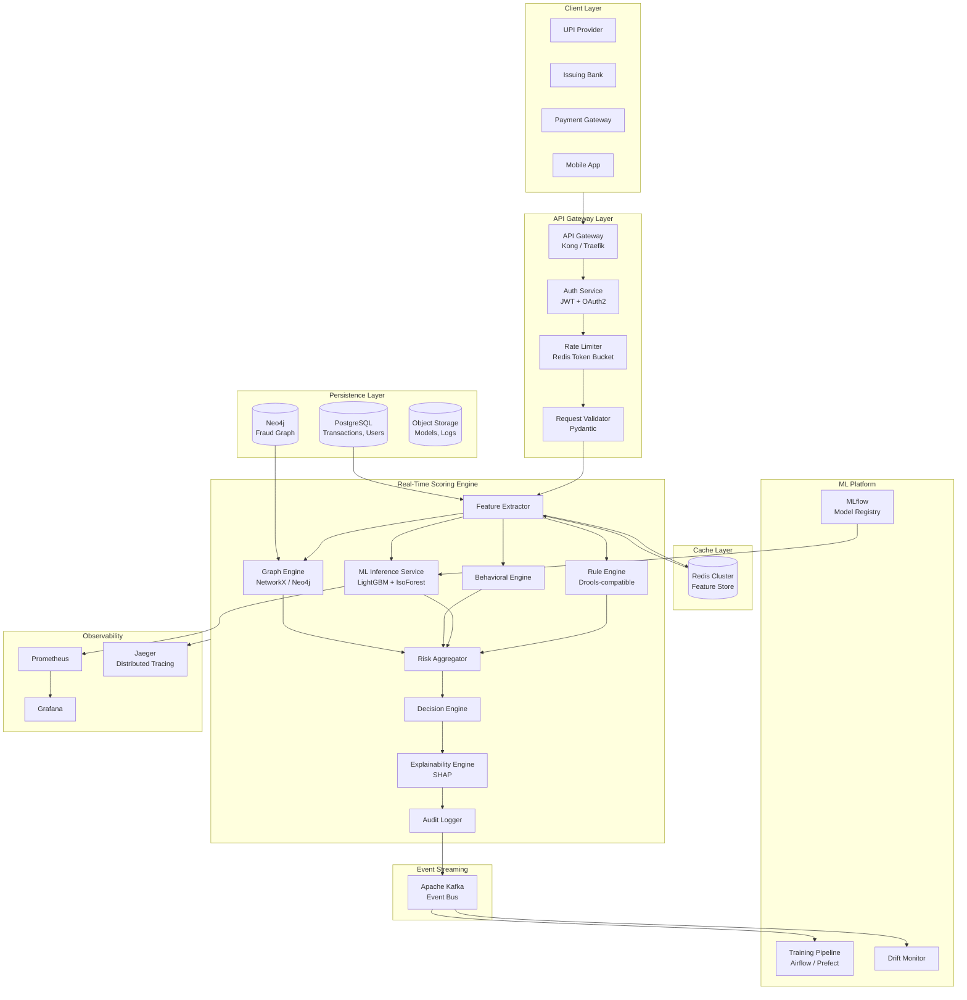
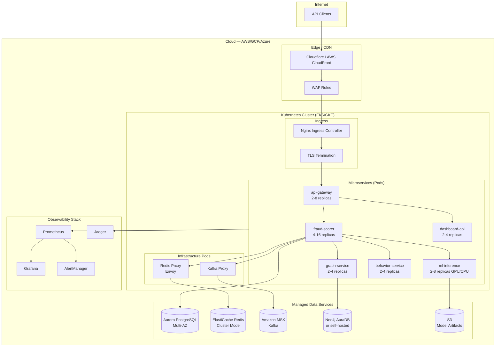
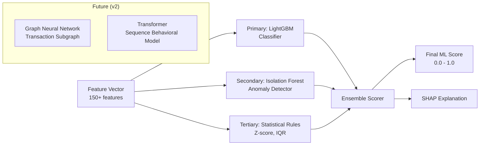
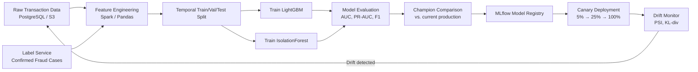
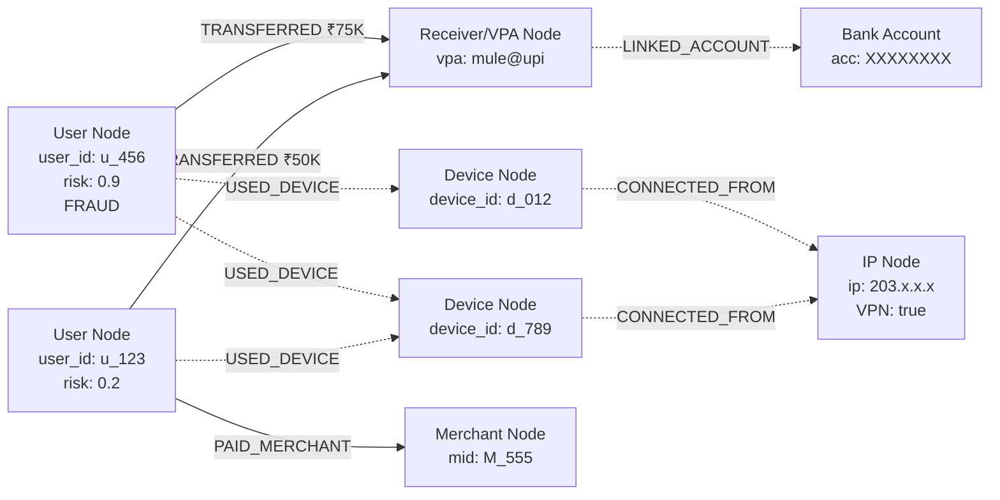
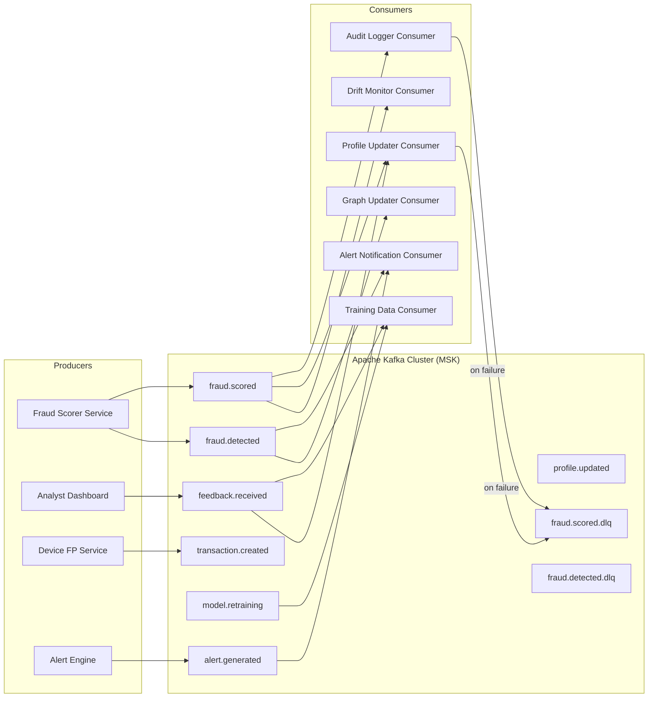
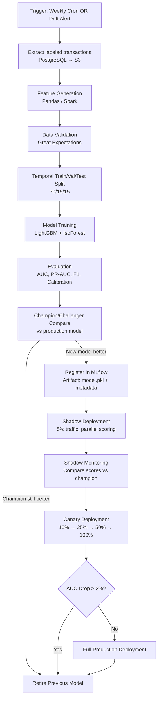
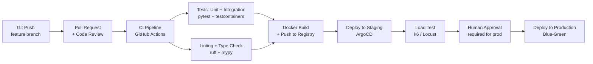

# FraudShield AI — Software Requirements Document (SRD)

**Document Version:** 1.0.0  
**Status:** Internal Engineering Draft  
**Classification:** CONFIDENTIAL — Internal Use Only  
**Authors:** Principal Software Architect, ML Engineering Team  
**Last Updated:** July 2026  
**Review Tier:** Staff Engineer / Principal Engineer Review Required  

---

> **Tagline:** Real-Time AI Fraud Scoring Engine for UPI Transactions  
> **Positioning:** "Stripe Radar for UPI" — a standalone, embeddable fraud intelligence API that banks, payment gateways, and UPI providers call before approving any transaction.

---

## Table of Contents

1. [Executive Summary](#1-executive-summary)
2. [Product Vision & Goals](#2-product-vision--goals)
3. [Users & Stakeholders](#3-users--stakeholders)
4. [System Architecture Overview](#4-system-architecture-overview)
5. [Real-Time Fraud Scoring Engine](#5-real-time-fraud-scoring-engine)
6. [Machine Learning Pipeline](#6-machine-learning-pipeline)
7. [Feature Engineering](#7-feature-engineering)
8. [Device Fingerprinting](#8-device-fingerprinting)
9. [Behavioral Analytics Engine](#9-behavioral-analytics-engine)
10. [Graph Analytics Engine](#10-graph-analytics-engine)
11. [Explainable AI (XAI)](#11-explainable-ai-xai)
12. [Latency Budget & Optimization](#12-latency-budget--optimization)
13. [Event-Driven Architecture](#13-event-driven-architecture)
14. [Database Design & Schemas](#14-database-design--schemas)
15. [API Design & Contracts](#15-api-design--contracts)
16. [Dashboard & UI Design](#16-dashboard--ui-design)
17. [Technology Stack](#17-technology-stack)
18. [Security Architecture](#18-security-architecture)
19. [Observability & Monitoring](#19-observability--monitoring)
20. [MLOps Pipeline](#20-mlops-pipeline)
21. [Deployment Architecture](#21-deployment-architecture)
22. [Non-Functional Requirements](#22-non-functional-requirements)
23. [Development Roadmap](#23-development-roadmap)
24. [Repository & Project Structure](#24-repository--project-structure)
25. [Risks & Assumptions](#25-risks--assumptions)
26. [Demo Flow for Judges](#26-demo-flow-for-judges)

---

## 1. Executive Summary

### 1.1 Problem Statement

Unified Payments Interface (UPI) processed over **131 billion transactions** in FY2024 with a total value exceeding ₹200 trillion. Fraud losses in digital payments in India reached **₹2,628 crores** in FY2024. Current fraud detection systems in the UPI ecosystem suffer from:

- **Reactive detection** — frauds identified post-settlement
- **Rule-based rigidity** — unable to adapt to evolving attack vectors
- **High false positive rates** — degrading legitimate user experience
- **No behavioral context** — treating every transaction in isolation
- **Opaque scoring** — no explainability for fraud analysts or regulators
- **Latency constraints** — slow systems that cannot integrate into the 200ms UPI approval window

### 1.2 Solution

FraudShield AI is a **production-grade, cloud-native, real-time fraud scoring microservice** that:

1. Scores every UPI transaction in **< 200ms** (p99)
2. Returns a structured **risk score (0.0–1.0)**, **confidence score**, and **decision** (APPROVE / REVIEW / REJECT)
3. Provides **machine-readable and human-readable explainability** with SHAP values and natural language summaries
4. Maintains **behavioral profiles** per user, device, and merchant
5. Runs **graph analytics** to detect fraud rings, money mules, and account takeover patterns
6. Supports **continuous learning** from analyst feedback

### 1.3 What This System Is NOT

- Not a payment application
- Not a bank or wallet
- Not a UPI switch or payment router
- Not a transaction settlement engine

It is a **pure scoring API** — a middleware layer that any payment system can invoke synchronously before approving a transaction.

---

## 2. Product Vision & Goals

### 2.1 Vision Statement

> Every UPI transaction evaluated by AI. Every fraud stopped before it clears. Every decision explained.

### 2.2 Core Goals

| Goal | Target | Measurement |
|------|--------|-------------|
| Scoring Latency (p99) | < 200ms | Prometheus `scoring_latency_p99` |
| Scoring Latency (p50) | < 80ms | Prometheus `scoring_latency_p50` |
| False Positive Rate | < 0.5% | Model evaluation pipeline |
| True Positive Rate (Recall) | > 92% | Model evaluation pipeline |
| System Availability | 99.99% | Uptime SLO |
| Throughput | 100,000 TPS | Load tests |
| Explainability Coverage | 100% of scored transactions | Audit logs |

### 2.3 Success Criteria for Hackathon

- Live scoring API operational and returning valid JSON responses
- Demo UI showing real-time transaction feed with fraud flags
- At least 3 fraud scenarios demonstrably detected
- Explainability output visible in UI
- System processes ≥ 5 concurrent requests within latency budget

---

## 3. Users & Stakeholders

### 3.1 Primary API Consumers (B2B)

| Actor | Use Case | Integration Point |
|-------|----------|-------------------|
| **UPI Provider (NPCI-like)** | Pre-approval fraud check on every transaction | `POST /score` (synchronous) |
| **Issuing Bank** | Block high-risk debit transactions | `POST /score` + webhook |
| **Payment Gateway** | Merchant-side fraud check | `POST /score` |
| **PSP (Paytm, PhonePe)** | Customer-side fraud scoring | `POST /score` |

### 3.2 Internal Users (Dashboard)

| Role | Permissions | Primary Tasks |
|------|-------------|---------------|
| **Fraud Analyst** | Read transactions, write feedback | Investigate flagged cases, label fraud |
| **Operations Engineer** | Read all, manage alerts | Monitor system health, triage incidents |
| **ML Engineer** | Full model access | Retrain models, monitor drift, deploy |
| **CISO / Compliance** | Read-only audit logs | Regulatory reporting, audit trail review |
| **Administrator** | Full system access | User management, rule configuration |

---

## 4. System Architecture Overview

### 4.1 High-Level Architecture



### 4.2 Request Sequence Diagram

```mermaid
sequenceDiagram
    autonumber
    participant C as Client (Bank/PSP)
    participant GW as API Gateway
    participant AUTH as Auth Service
    participant FE as Feature Extractor
    participant REDIS as Redis Cache
    participant RE as Rule Engine
    participant ML as ML Inference
    participant BE as Behavioral Engine
    participant GE as Graph Engine
    participant AGG as Risk Aggregator
    participant DE as Decision Engine
    participant XAI as XAI Engine
    participant AL as Audit Logger
    participant KAFKA as Kafka

    Note over C,KAFKA: Total Budget: < 200ms

    C->>+GW: POST /score {transaction}
    Note right of GW: t=0ms
    GW->>+AUTH: Validate JWT/API Key
    AUTH-->>-GW: 200 OK (principal)
    Note right of GW: t=5ms

    GW->>+FE: Extract features
    FE->>+REDIS: GET user_profile, device_fp, velocity
    REDIS-->>-FE: Cached features (hit)
    Note right of FE: t=15ms

    par Parallel Execution
        FE->>+RE: Evaluate rules
        RE-->>-FE: Rule flags
    and
        FE->>+ML: Run inference
        ML-->>-FE: {score, shap_values}
    and
        FE->>+BE: Behavioral deviation
        BE-->>-FE: {deviation_score}
    and
        FE->>+GE: Graph risk check
        GE-->>-FE: {graph_risk, flags}
    end

    Note right of FE: t=120ms (parallel block)

    FE->>+AGG: Aggregate all signals
    AGG-->>-FE: {composite_risk}
    Note right of AGG: t=140ms

    AGG->>+DE: Make decision
    DE-->>-AGG: {APPROVE|REVIEW|REJECT}

    DE->>+XAI: Generate explanation
    XAI-->>-DE: {reasons, shap, nl_summary}
    Note right of XAI: t=170ms

    DE->>+AL: Write audit log (async)
    AL--)KAFKA: Publish fraud.scored event
    Note right of AL: async, non-blocking

    DE-->>-GW: Scoring response
    GW-->>-C: 200 {risk_score, decision, explanation}
    Note right of GW: t=185ms (p99 target)
```

### 4.3 Deployment Architecture



---

## 5. Real-Time Fraud Scoring Engine

### 5.1 Component Responsibilities

Each component in the scoring pipeline owns a strict latency budget. No component may block the synchronous path with I/O it owns exclusively — all DB writes are async via Kafka.

---

#### 5.1.1 API Gateway

**Purpose:** Single entry point. Enforces authentication, rate limiting, request routing, and TLS termination.

**Responsibilities:**
- TLS 1.3 termination
- JWT / API Key authentication (delegated to Auth Service)
- Per-client rate limiting (token bucket, Redis-backed)
- Request routing to fraud-scorer service
- Response compression (gzip/brotli)
- Circuit breaker for downstream services

**Inputs:** Raw HTTPS request from client  
**Outputs:** Authenticated, validated request context forwarded to fraud-scorer  
**Technology:** Kong (open-source) or Traefik, backed by Redis for rate limiting state

**Scaling:** Stateless — horizontal scaling behind load balancer. Target: 2–16 replicas, HPA on CPU > 70%.

**Failure Handling:**
- Auth service down → fail-open with degraded mode (log + pass-through with warning flag) OR fail-closed (recommended for production)
- Redis down → in-memory rate limiting fallback (per-pod, approximate)

**Latency Budget:** 5ms (auth validation from cache) + 2ms (rate limit check) = **7ms total**

---

#### 5.1.2 Auth Service

**Purpose:** Validate API consumers and attach principal context (org_id, permissions, tier).

**Responsibilities:**
- JWT signature verification (RS256)
- API key lookup and validation
- RBAC principal attachment
- Token expiry enforcement

**Inputs:** Authorization header (Bearer JWT or X-API-Key)  
**Outputs:** Principal object `{org_id, client_id, roles[], tier}`  
**Technology:** FastAPI microservice, RSA public key cached in memory

**Scaling:** Stateless. JWT validation is CPU-bound, not I/O-bound. 2–4 replicas sufficient.

**Failure Handling:** If Auth Service is unreachable, API Gateway returns 503. Never fail-open in production.

**Latency Budget:** 3ms (JWT validation is in-memory cryptographic op)

---

#### 5.1.3 Transaction Validator

**Purpose:** Schema validation and basic sanity checks before any ML processing occurs — fail fast, fail cheap.

**Responsibilities:**
- JSON schema validation (Pydantic v2)
- Required field presence (sender_vpa, receiver_vpa, amount, device_id, timestamp)
- Amount range validation (₹1 – ₹200,000 per UPI limits)
- VPA format validation (regex)
- Timestamp freshness check (reject if > 30s old, possible replay attack)
- Idempotency check (transaction_id deduplication via Redis SETNX)

**Inputs:** Raw transaction JSON  
**Outputs:** Validated `Transaction` domain object or `400 Bad Request`  
**Technology:** Pydantic v2 (Rust-backed validation), Redis for dedup

**Failure Handling:** Validation errors return structured `400` with specific field-level errors. Redis dedup failure → allow through with `idempotency_check=false` flag in context.

**Latency Budget:** 2ms

---

#### 5.1.4 Feature Extractor

**Purpose:** Orchestrates parallel feature retrieval from all feature sources and assembles the feature vector for ML inference.

**Responsibilities:**
- Spawn async coroutines for each feature domain (behavioral, velocity, device, graph)
- Assemble feature vector `Dict[str, float]`
- Handle partial feature failures gracefully (use defaults/nulls for missing features)
- Log feature fetch latencies per domain

**Inputs:** Validated `Transaction` object  
**Outputs:** `FeatureVector` (150+ features)

**Design Decision — Why asyncio concurrency:**  
Feature retrieval is I/O-bound (Redis, DB reads). Python asyncio allows all lookups to execute concurrently within a single event loop, avoiding thread-per-request overhead. Using `asyncio.gather()` with timeout budgets per feature group.

**Failure Handling:**
- Per-feature timeout: 30ms hard limit. Features that don't return in time are set to `None` (model handles missing values).
- Redis connection error: Fall back to PostgreSQL for critical features (user profile).

**Latency Budget:** 20ms (parallel I/O, dominated by Redis RTT ~1ms × pipeline depth)

---

#### 5.1.5 Feature Store

**Purpose:** Low-latency storage and retrieval of pre-computed feature values.

**Architecture:** Two-tier
- **L1 — Redis (Hot):** Sub-millisecond lookup. Stores: user behavioral profile, velocity counters (1m/5m/1h/24h), device fingerprint, recent fraud flags.
- **L2 — PostgreSQL (Warm):** Sub-10ms lookup. Historical aggregates, merchant risk scores, VPA reputation.

**Key Redis Data Structures:**

```
user:{user_id}:profile          → Hash (behavioral features)
user:{user_id}:velocity:1m      → Counter (TTL 60s, INCR)
user:{user_id}:velocity:5m      → Counter (TTL 300s)
user:{user_id}:velocity:1h      → Counter (TTL 3600s)
user:{user_id}:velocity:24h     → Counter (TTL 86400s)
device:{device_id}:fp           → Hash (device features)
device:{device_id}:users        → Set (user_ids seen on this device)
vpa:{receiver_vpa}:risk         → Float (receiver reputation score)
ip:{ip_address}:reputation      → Hash (ISP, proxy flag, abuse score)
```

**Scaling:** Redis Cluster (6 nodes minimum: 3 primary + 3 replica). Sharded by `user_id`.

**Failure Handling:** Redis unavailability triggers L2 fallback. L2 unavailability triggers feature defaults (zero-filled, model calibrated to handle this via imputation).

---

#### 5.1.6 Rule Engine

**Purpose:** Fast, deterministic, human-readable rule evaluation before ML inference. Rules catch known fraud patterns with zero latency and zero model dependency.

**Responsibilities:**
- Evaluate ordered rule set against transaction + features
- Return rule flags: `List[RuleFlag]` with rule_id, severity, triggered
- Short-circuit on critical rules (e.g., blacklisted VPA → immediate REJECT)

**Rule Examples:**

| Rule ID | Condition | Action | Priority |
|---------|-----------|--------|----------|
| `R001` | receiver_vpa in blacklist | REJECT | CRITICAL |
| `R002` | amount > user_max_ever × 3 | FLAG | HIGH |
| `R003` | txn_count_1m > 5 | FLAG | HIGH |
| `R004` | device_id == new AND amount > 10000 | FLAG | MEDIUM |
| `R005` | geo_distance_from_last_txn > 500km AND time_delta < 30min | FLAG | HIGH |
| `R006` | receiver_is_new AND amount > user_avg × 5 | FLAG | MEDIUM |
| `R007` | device_rooted == true AND amount > 5000 | FLAG | MEDIUM |
| `R008` | ip_is_vpn == true | FLAG | LOW |

**Technology:** Custom Python rule engine. Rules stored in PostgreSQL, hot-loaded into memory on service startup, refreshed every 60s via background task. JSON DSL for rule definitions — editable by fraud analysts without redeployment.

**Rule DSL Example:**
```json
{
  "rule_id": "R005",
  "name": "Impossible Travel",
  "condition": {
    "AND": [
      {"feature": "geo_distance_km", "op": "gt", "value": 500},
      {"feature": "time_since_last_txn_min", "op": "lt", "value": 30}
    ]
  },
  "action": "FLAG",
  "severity": "HIGH",
  "explanation": "Transaction location is physically impossible given prior transaction timing"
}
```

**Inputs:** Feature vector + transaction  
**Outputs:** `List[RuleFlag]`, `has_critical_flag: bool`

**Latency Budget:** 5ms (in-memory rule evaluation, no I/O)

**Failure Handling:** Rule engine failure → log error, continue scoring without rule flags (ML alone decides).

---

#### 5.1.7 ML Inference Service

**Purpose:** Score the transaction using trained ML models. Returns a probability score and SHAP explanation values.

See [Section 6](#6-machine-learning-pipeline) for full ML architecture.

**Inputs:** Feature vector (150+ features)  
**Outputs:** `{ml_score: float, shap_values: Dict[str, float], model_version: str}`

**Latency Budget:** 30ms (LightGBM inference on CPU is typically 2–10ms; 30ms budget includes model loading overhead and SHAP computation)

---

#### 5.1.8 Behavioral Engine

**Purpose:** Compare current transaction against the user's historical behavioral baseline. Returns a deviation score.

See [Section 9](#9-behavioral-analytics-engine) for full design.

**Inputs:** Transaction + user behavioral profile (from Feature Store)  
**Outputs:** `{deviation_score: float, anomalous_dimensions: List[str]}`

**Latency Budget:** 15ms (Redis fetch + statistical computation)

---

#### 5.1.9 Graph Engine

**Purpose:** Evaluate the transaction's position in the fraud graph. Detect if sender, receiver, device, or IP are connected to known fraud nodes.

See [Section 10](#10-graph-analytics-engine) for full design.

**Inputs:** sender_vpa, receiver_vpa, device_id, ip_address  
**Outputs:** `{graph_risk_score: float, fraud_ring_flag: bool, graph_flags: List[str]}`

**Latency Budget:** 25ms (Neo4j Cypher query with indexed traversal, or pre-computed risk scores from Redis)

**Design Decision — Pre-computation:** For hackathon, graph risk scores for known VPAs/devices are pre-computed every 5 minutes and cached in Redis. Full real-time graph traversal is production v2.

---

#### 5.1.10 Risk Aggregator

**Purpose:** Combine signals from ML, rules, behavioral, and graph engines into a single composite risk score.

**Aggregation Formula:**

```
composite_risk = (
    w_ml      × ml_score          +  # 0.45
    w_rules   × rule_risk         +  # 0.25
    w_behavior× deviation_score   +  # 0.20
    w_graph   × graph_risk_score  +  # 0.10
)

# Weights are configurable and stored in Feature Store
# rule_risk = 0.0 if no flags, escalates per severity:
#   LOW=0.2, MEDIUM=0.5, HIGH=0.8, CRITICAL=1.0
```

**Override Logic:**
- If `has_critical_rule_flag == True` → composite_risk = max(composite_risk, 0.95)
- If `graph.fraud_ring_flag == True` → composite_risk = max(composite_risk, 0.90)
- If `ml_score > 0.99` → composite_risk = 0.99 (cap, allow human review)

**Inputs:** Scores from all sub-engines  
**Outputs:** `{composite_risk: float[0,1], confidence: float[0,1], contributing_signals: Dict}`

**Confidence Score Calculation:**

```
confidence = 1.0 - (
    feature_missing_fraction × 0.3 +
    model_uncertainty_estimate × 0.5 +  # IsoForest anomaly score divergence
    behavioral_data_staleness_factor × 0.2
)
```

**Latency Budget:** 5ms (pure computation, no I/O)

---

#### 5.1.11 Decision Engine

**Purpose:** Convert composite risk score into a business decision with configurable thresholds.

**Decision Thresholds (configurable per org/tier):**

| Decision | Condition | Default Threshold |
|----------|-----------|------------------|
| `APPROVE` | composite_risk < 0.35 | Configurable |
| `REVIEW` | 0.35 ≤ composite_risk < 0.75 | Configurable |
| `REJECT` | composite_risk ≥ 0.75 | Configurable |

**Configurable Thresholds:** Different API consumers may have different risk tolerance. A conservative bank may set REVIEW at 0.25. A lenient gateway may set REJECT at 0.85. Thresholds stored per `org_id` in PostgreSQL, cached in Redis with 5-minute TTL.

**Inputs:** Aggregated risk scores  
**Outputs:** `{decision: "APPROVE"|"REVIEW"|"REJECT", risk_score: float, confidence: float}`

**Latency Budget:** 2ms

---

#### 5.1.12 Explainability Engine

**Purpose:** Generate human-readable and machine-readable explanations for every scoring decision.

See [Section 11](#11-explainable-ai-xai) for full design.

**Inputs:** SHAP values, rule flags, graph flags, behavioral flags  
**Outputs:** `{reasons: List[str], top_features: List[FeatureContribution], nl_summary: str, shap_values: Dict}`

**Latency Budget:** 15ms

---

#### 5.1.13 Audit Logger

**Purpose:** Immutable, append-only audit trail for every scoring event. Required for compliance, fraud investigation, and model retraining.

**Design:** Non-blocking write. The scoring API does NOT wait for the audit log to complete. The audit log is written to Kafka (`fraud.scored` topic) asynchronously after the response is sent.

**What is logged:**
- Full transaction payload
- All feature values
- Scores from each sub-engine
- Final decision
- SHAP values
- Request metadata (client_id, latency, model_version)
- Timestamp (nanosecond precision)

**Storage:** Kafka → Flink/consumer → PostgreSQL `audit_log` table + S3 cold archive

**Latency Budget:** 0ms (async, fire-and-forget from scoring path)

---

#### 5.1.14 Response Generator

**Purpose:** Serialize final scoring response into the standardized JSON contract.

**Inputs:** Decision, explanation, scores, metadata  
**Outputs:** HTTP 200 JSON response (see [Section 15](#15-api-design--contracts))

**Latency Budget:** 2ms

---

## 6. Machine Learning Pipeline

### 6.1 Model Architecture

FraudShield AI uses a **hybrid ensemble** approach — not a single model, but a complementary set of models each with distinct roles.



---

### 6.2 Primary Model — LightGBM Classifier

**Why LightGBM?**

LightGBM is the industry standard for tabular fraud detection at low latency. Used by Grab, Alibaba's risk team, and reportedly in components of Stripe Radar:

- **Gradient Boosted Decision Trees** — handles mixed feature types (numerical + categorical) without preprocessing overhead
- **Leaf-wise tree growth** — more accurate than level-wise (XGBoost default) with same number of trees
- **Native categorical support** — VPA categories, merchant codes don't require one-hot encoding
- **SHAP integration** — native TreeExplainer is 100× faster than model-agnostic SHAP
- **Inference speed** — 2–5ms for 150 features on single CPU core
- **Imbalanced data handling** — `scale_pos_weight` for extreme class imbalance (fraud rate ~0.1%)
- **Memory efficiency** — histogram-based algorithm is cache-friendly

**Disadvantages:**
- Doesn't model sequential/temporal patterns natively (addressed by behavioral features)
- Feature interactions beyond depth-limit not captured
- Requires periodic retraining as fraud patterns shift

**Training Configuration:**

```python
lgb_params = {
    "objective": "binary",
    "metric": ["auc", "binary_logloss", "aucpr"],
    "boosting_type": "gbdt",
    "num_leaves": 63,
    "max_depth": 7,
    "learning_rate": 0.05,
    "n_estimators": 500,
    "scale_pos_weight": 99,          # 1% fraud rate → weight = 99
    "min_child_samples": 50,
    "feature_fraction": 0.8,
    "bagging_fraction": 0.8,
    "bagging_freq": 5,
    "lambda_l1": 0.1,
    "lambda_l2": 0.2,
    "early_stopping_rounds": 50,
    "verbose": -1,
    "device": "cpu",                 # GPU optional for training
    "num_threads": 4,
}
```

**Training Data Requirements:**
- Minimum 500K transactions with confirmed labels
- Synthetic dataset: PaySim, IEEE-CIS Fraud Detection (Kaggle), custom UPI-style generator
- Label: `is_fraud` (binary)
- Temporal split: train on T-90 days, validate on T-30 to T-7, test on T-7 to T

**Serving:**
- Model serialized to `.pkl` (joblib) + `.txt` (LightGBM native)
- Loaded into memory at service startup
- Version pinned to model_version string
- Zero-downtime reload via signal handling

**Monitoring:**
- Input feature distribution drift (KL divergence vs. training distribution)
- Score distribution shift (PSI — Population Stability Index)
- AUC degradation on labeled feedback data
- Inference latency (p50, p95, p99)

**Retraining:** Weekly batch retrain. Emergency retrain triggered if PSI > 0.25 or AUC < 0.88.

---

### 6.3 Secondary Model — Isolation Forest

**Why Isolation Forest?**

LightGBM is a supervised model — it requires labeled fraud data. Isolation Forest is **unsupervised** and detects novelty/anomalies in unlabeled transaction streams. This is critical because:

- New fraud attack patterns have no labels initially
- Isolation Forest can flag anomalous transactions even before labeled data exists
- Provides a **model uncertainty signal** — when IsoForest anomaly score and LightGBM score diverge significantly, confidence in the final score is reduced

**Algorithm:** Randomly partition feature space by sampling features and split points. Anomalies (rare patterns) require fewer splits to isolate → lower average path length → higher anomaly score.

**Training:** Fit on 30-day rolling window of ALL transactions (majority legit). Contamination parameter: 0.02 (assume ~2% anomalies).

**Serving:**
- `sklearn.ensemble.IsolationForest` serialized with joblib
- Outputs: anomaly_score ∈ [-1, 1] → normalized to [0, 1]
- Inference: 5ms for 150 features

**Disadvantages:**
- High false positive rate on its own — must be used as a signal, not a decision
- Doesn't provide SHAP explanations (use permutation importance as proxy)

**Use in Ensemble:** IsoForest score contributes 15% weight to ensemble. Primary use: confidence calibration.

---

### 6.4 Ensemble Strategy

```python
def ensemble_score(lgb_score: float, iso_score: float, stat_score: float) -> tuple[float, float]:
    """
    Combine scores from multiple models.
    Returns (ml_score, confidence).
    """
    # Weighted ensemble
    ml_score = (
        0.75 * lgb_score +
        0.15 * iso_score +
        0.10 * stat_score
    )
    
    # Confidence: penalize when models disagree
    disagreement = abs(lgb_score - iso_score)
    confidence = 1.0 - (0.5 * disagreement)
    
    return ml_score, confidence
```

---

### 6.5 Future Models (v2 Roadmap)

#### Graph Neural Network (GNN)

**Purpose:** Model the transaction graph structure directly. Learn fraud patterns from the topology of who pays whom, which devices are shared, which IPs overlap.

**Architecture:** GraphSAGE or Graph Attention Network (GAT)  
**Why later:** Requires Neo4j → PyG/DGL integration, significant engineering effort, and ~50ms additional latency. Justified only when graph features alone are insufficient.

#### Transformer Behavioral Model

**Purpose:** Model the sequential nature of user transaction history. A user's last 50 transactions form a "sequence" — the Transformer attends to this sequence to detect unusual patterns (similar to fraud detection at Revolut and N26).

**Architecture:** 4-layer Transformer encoder, sequence length 50, embedding dim 64  
**Why later:** Requires sequence padding, positional encoding, and a separate inference endpoint. Adds ~40ms latency. The behavioral feature engineering (Section 9) approximates this with statistical summaries for the hackathon.

---

### 6.6 Model Training Pipeline



---

## 7. Feature Engineering

### 7.1 Overview

The feature vector contains **150+ features** across 11 domains. All features are computed either at query time (online features, from Redis/DB) or pre-computed via batch jobs (offline features, stored in Feature Store).

**Feature Types:**
- **Online (real-time):** Computed at scoring time using current transaction + cached state
- **Offline (batch):** Computed in batch jobs, stored in Feature Store, retrieved at scoring time

---

### 7.2 Transaction Features (Real-Time)

| Feature | Purpose | Formula/Logic | Storage | Latency |
|---------|---------|---------------|---------|---------|
| `txn_amount` | Raw amount | As-is | In-request | 0ms |
| `txn_amount_log` | Normalize large amounts | `log1p(amount)` | Computed | 0ms |
| `txn_hour` | Time of day | `hour(timestamp)` | Computed | 0ms |
| `txn_day_of_week` | Weekday vs. weekend | `dayofweek(timestamp)` | Computed | 0ms |
| `txn_is_weekend` | Weekend flag | `day_of_week in [5,6]` | Computed | 0ms |
| `txn_is_night` | Night transaction | `hour in [0,5]` | Computed | 0ms |
| `txn_currency` | Currency code | Enum encoded | In-request | 0ms |
| `txn_type` | P2P / P2M | Enum | In-request | 0ms |
| `amount_vs_user_avg_ratio` | Amount relative to user baseline | `amount / user_avg_txn_amount` | Computed + Redis | 2ms |
| `amount_vs_user_max_ratio` | Amount relative to user max | `amount / user_max_txn_amount` | Computed + Redis | 2ms |
| `amount_round_number_flag` | Round amounts are suspicious | `amount % 100 == 0` | Computed | 0ms |
| `amount_just_below_limit_flag` | Structuring detection | `9500 < amount < 10000` | Computed | 0ms |

---

### 7.3 Velocity Features (Online, Redis)

Velocity features capture **how many transactions** a user has made in recent time windows. Spikes indicate fraud.

| Feature | Purpose | Formula | Storage | TTL |
|---------|---------|---------|---------|-----|
| `vel_txn_count_1m` | Burst detection | INCR + EXPIRE | Redis Counter | 60s |
| `vel_txn_count_5m` | Short-term velocity | INCR + EXPIRE | Redis Counter | 300s |
| `vel_txn_count_1h` | Hourly velocity | INCR + EXPIRE | Redis Counter | 3600s |
| `vel_txn_count_24h` | Daily velocity | INCR + EXPIRE | Redis Counter | 86400s |
| `vel_amount_sum_1h` | Total spend (1h) | INCR by amount | Redis Counter | 3600s |
| `vel_amount_sum_24h` | Total spend (24h) | INCR by amount | Redis Counter | 86400s |
| `vel_unique_receivers_1h` | Receiver diversity (1h) | PFADD (HyperLogLog) | Redis HLL | 3600s |
| `vel_unique_receivers_24h` | Receiver diversity (24h) | PFADD | Redis HLL | 86400s |
| `vel_failed_txn_count_1h` | Failed transaction spike | INCR on fail | Redis Counter | 3600s |
| `vel_new_device_count_7d` | New device usage | Redis Set CARD | Redis Set | 7d |

**Example Values for Fraud Signal:**
- `vel_txn_count_1m > 5` → extremely suspicious (normal: 0–1)
- `vel_unique_receivers_1h > 10` → suspicious (normal: 1–2)
- `vel_amount_sum_1h > user_avg_monthly × 0.5` → very high risk

---

### 7.4 Behavioral Features (Offline, Redis)

Pre-computed user behavioral baselines, updated in rolling batch jobs every 15 minutes.

| Feature | Purpose | Formula | Storage |
|---------|---------|---------|---------|
| `user_avg_txn_amount_30d` | Average transaction amount | `mean(amounts, 30d)` | Redis Hash |
| `user_std_txn_amount_30d` | Amount volatility | `std(amounts, 30d)` | Redis Hash |
| `user_max_txn_amount_30d` | Historical max | `max(amounts, 30d)` | Redis Hash |
| `user_median_txn_amount_30d` | Median (robust to outliers) | `median(amounts, 30d)` | Redis Hash |
| `user_avg_txn_count_per_day_30d` | Daily frequency baseline | `count/30` | Redis Hash |
| `user_preferred_hour_mode` | Typical transaction hour | `mode(hours, 30d)` | Redis Hash |
| `user_txn_hour_std` | Time-of-day consistency | `std(hours, 30d)` | Redis Hash |
| `user_unique_receivers_30d` | Receiver diversity | `HLL(receivers, 30d)` | Redis HLL |
| `user_pct_new_receivers_7d` | New receiver rate | `new_receivers/total` | Redis Hash |
| `user_pct_night_txns_30d` | Night transaction rate | `night_count/total` | Redis Hash |
| `user_pct_weekend_txns_30d` | Weekend transaction rate | `weekend_count/total` | Redis Hash |
| `user_merchant_diversity_30d` | Merchant variety | `HLL(merchants, 30d)` | Redis HLL |
| `user_avg_geo_distance_from_home` | Distance from home location | `mean(geo_dist, 30d)` | Redis Hash |
| `user_account_age_days` | Account tenure | `now - account_created` | PostgreSQL |
| `user_first_txn_flag` | First-ever transaction | `txn_count == 1` | Redis Hash |

---

### 7.5 Location Features (Online)

| Feature | Purpose | Formula | Source |
|---------|---------|---------|--------|
| `geo_lat`, `geo_lon` | Current location | From device | In-request |
| `geo_distance_from_last_txn_km` | Location jump | Haversine formula | Redis (last location) |
| `geo_speed_kmh` | Implied travel speed | `distance / time_delta` | Computed |
| `geo_is_impossible_travel` | Physics violation | `speed > 800 km/h` (flight excluded) | Computed |
| `geo_country_code` | Country | Reverse geocode / IP | GeoIP DB |
| `geo_is_international` | Cross-border flag | `country != user_home_country` | Computed |
| `geo_distance_from_home` | Distance from registered address | Haversine from home_lat/lon | Redis + Computed |
| `geo_is_new_city` | City never transacted from | Redis Set lookup | Redis Set |
| `ip_country` | IP-based country | MaxMind GeoIP | In-memory DB |
| `ip_vs_gps_country_mismatch` | IP/GPS mismatch | `ip_country != geo_country` | Computed |

---

### 7.6 Device Features (Online, Redis)

| Feature | Purpose | Formula | Source |
|---------|---------|---------|--------|
| `device_is_new` | First time this device | Redis Set SISMEMBER | Redis |
| `device_is_trusted` | User marked as trusted | Redis Hash | Redis |
| `device_is_rooted` | Root/jailbreak flag | From device fingerprint | Device FP API |
| `device_is_emulator` | Emulator detection | From device fingerprint | Device FP API |
| `device_app_version` | App version | From request header | In-request |
| `device_os_version` | OS version | From device FP | Device FP |
| `device_user_count` | Users seen on this device | Redis Set SCARD | Redis |
| `device_txn_count_lifetime` | Total transactions from device | Redis Counter | Redis |
| `device_sim_changed_flag` | SIM swap detection | From device FP | Device FP |
| `device_vpn_flag` | VPN usage | IP reputation DB | Redis Cache |
| `device_proxy_flag` | Proxy/Tor usage | IP reputation DB | Redis Cache |
| `device_fraud_flag_ever` | Device ever flagged | Redis Hash | Redis |

---

### 7.7 Merchant / Receiver Features (Offline, Redis)

| Feature | Purpose | Formula | Storage |
|---------|---------|---------|---------|
| `receiver_is_new` | First time receiving | Redis Set SISMEMBER | Redis |
| `receiver_fraud_rate_30d` | Receiver fraud history | `fraud_count/total_count` | Redis Hash |
| `receiver_txn_count_30d` | Activity level | Count | Redis Counter |
| `receiver_avg_received_amount` | Average receipt | Mean | Redis Hash |
| `receiver_is_blacklisted` | Known fraud VPA | Redis Set SISMEMBER | Redis Set |
| `receiver_is_high_risk_merchant` | Merchant risk category | Merchant DB lookup | PostgreSQL |
| `merchant_category_code` | MCC code | Merchant DB | PostgreSQL |
| `merchant_chargeback_rate` | Historical chargeback rate | Offline batch | Redis Hash |

---

### 7.8 Graph Features (Pre-computed + Online)

| Feature | Purpose | Formula | Source |
|---------|---------|---------|--------|
| `sender_graph_risk_score` | Node risk from graph | Pre-computed PageRank variant | Redis |
| `receiver_graph_risk_score` | Receiver graph risk | Pre-computed | Redis |
| `sender_fraud_ring_member` | In a known fraud ring | Graph community detection | Redis |
| `shared_device_count` | Devices shared with fraud users | Graph traversal | Neo4j/Cache |
| `hops_to_known_fraud` | Shortest path to fraud node | BFS depth | Neo4j/Cache |
| `receiver_in_fraud_subgraph` | Receiver connected to fraud | Flag | Redis |
| `sender_out_degree` | Number of unique payees | Graph metric | Neo4j/Cache |
| `receiver_in_degree` | Number of unique payers | Graph metric | Neo4j/Cache |

---

### 7.9 Temporal Features (Online)

| Feature | Purpose | Formula | Source |
|---------|---------|---------|--------|
| `time_since_last_txn_seconds` | Time gap from prior transaction | `now - last_txn_time` | Redis |
| `time_since_account_login_seconds` | Post-login transaction speed | `now - last_login` | Redis |
| `txn_burst_flag` | Multiple transactions in seconds | `time_since_last < 10s` | Computed |
| `days_since_last_fraud_flag` | Recency of prior fraud | `now - last_fraud_date` | Redis |

---

### 7.10 Risk Aggregation Features (Computed)

| Feature | Purpose | Formula | Source |
|---------|---------|---------|--------|
| `rule_flag_count` | Number of rules triggered | Count from Rule Engine | Computed |
| `rule_max_severity_score` | Worst rule severity | Max(severity_scores) | Computed |
| `behavioral_deviation_score` | Deviation from baseline | Z-score composite | Behavioral Engine |
| `device_risk_score` | Device-level risk | Weighted device features | Computed |
| `location_risk_score` | Location-based risk | Weighted geo features | Computed |

---

## 8. Device Fingerprinting

### 8.1 Purpose

Device fingerprinting assigns a stable, unique identifier to each device independent of user login. It detects:
- **Account Takeover (ATO):** Legitimate user credentials used on a new/suspicious device
- **Device Emulation Fraud:** Fraudsters using emulators to simulate legitimate devices
- **SIM Swap Fraud:** Attacker acquires victim's phone number on a new device
- **Device Sharing:** Multiple user accounts operating from the same device (mule accounts)
- **Trusted Device Bypassing:** Fraudulent use of a previously trusted device (device compromise)

### 8.2 Fingerprint Components

```mermaid
graph TD
    DFP[Device Fingerprint Module]
    
    DFP --> HW[Hardware Signals]
    DFP --> OS_SIG[OS Signals]
    DFP --> NET[Network Signals]
    DFP --> APP_SIG[App Signals]
    DFP --> BEHAV[Behavioral Biometrics]

    HW --> CPUID[CPU ID / Model]
    HW --> RAMSIZE[RAM Size]
    HW --> SCREENRES[Screen Resolution]
    HW --> GPU[GPU Model]
    HW --> BATTERY[Battery Capacity]

    OS_SIG --> OSVER[OS Version]
    OS_SIG --> KERNEL[Kernel Version]
    OS_SIG --> BUILDNUM[Build Number]
    OS_SIG --> ROOTED[Root/Jailbreak Status]
    OS_SIG --> EMUCHECK[Emulator Indicators]

    NET --> IPADDR[IP Address]
    NET --> IPREPUT[IP Reputation Score]
    NET --> CARRIER[Mobile Carrier]
    NET --> SIMHASH[SIM Card Hash]
    NET --> VPNFLAG[VPN/Proxy Flag]

    APP_SIG --> APPVER[App Version]
    APP_SIG --> INSTID[Install ID]
    APP_SIG --> CERTPIN[Certificate Pinning Status]
    APP_SIG --> TAMPDET[Tamper Detection]

    BEHAV --> TOUCHDYN[Touch Dynamics]
    BEHAV --> TYPESPEED[Typing Speed / Pattern]
    BEHAV --> GYRO[Gyroscope Patterns]
```



### 8.3 Device ID Generation

```python
def generate_device_id(fingerprint_components: dict) -> str:
    """
    Generate a stable device ID from hardware/OS signals.
    Uses SHA-256 of sorted, normalized component string.
    
    Stability: Device ID should remain stable across:
    - App reinstalls (excluded: install_id)
    - OS minor updates (included at major version level)
    - Network changes (excluded: IP address)
    """
    stable_components = [
        fingerprint_components["cpu_model"],
        fingerprint_components["screen_resolution"],
        fingerprint_components["gpu_model"],
        str(fingerprint_components["ram_gb"]),
        fingerprint_components["os_major_version"],
        fingerprint_components["carrier_hash"],
        fingerprint_components["sim_hash"],
    ]
    
    canonical = "|".join(sorted(stable_components))
    return hashlib.sha256(canonical.encode()).hexdigest()[:32]
```

### 8.4 Root/Emulator Detection

**Root Detection Signals:**
- Presence of root binaries (`/system/xbin/su`, `/sbin/su`)
- Test-keys in build tags (Android)
- Dangerous props (`ro.debuggable=1`, `ro.secure=0`)
- Superuser app installed
- Xposed/Magisk framework detected

**Emulator Detection Signals:**
- CPU architecture is x86 (most Android emulators)
- `ro.hardware` values: `goldfish`, `ranchu`, `vbox86`
- Accelerometer reports all-zero values
- No telephony hardware (IMEI = null)
- Build fingerprint contains "google/sdk_gphone"
- Performance benchmarks inconsistent with claimed hardware

**Risk Mapping:**
- `device_rooted=True` → device_risk += 0.3
- `device_emulator=True` → device_risk += 0.7 (extremely suspicious for payments)
- `cert_pinning_bypassed=True` → device_risk += 0.5

### 8.5 SIM Change Detection

SIM swap fraud involves an attacker porting the victim's phone number to a SIM they control (to receive OTPs).

**Detection:**
1. Hash of SIM serial number (ICCID) stored at last login
2. At transaction time, compare current ICCID hash with stored hash
3. If mismatch: `sim_changed_flag=True`
4. Additionally check: `days_since_sim_change < 7` → high risk

### 8.6 IP Reputation

**IP Reputation Data Sources:**
- MaxMind GeoIP2 (ISP, organization, country, city)
- AbuseIPDB API (abuse confidence score)
- Tor exit node list (public, updated daily)
- VPN provider IP ranges (commercial lists)
- Proxy IP lists (datacenter IP ranges)

**Redis Cache Key:** `ip:{ip_hash}:reputation` (TTL: 1 hour)

**Risk Signals:**
- `ip_is_tor=True` → ip_risk += 0.8
- `ip_is_datacenter=True` → ip_risk += 0.4 (legitimate mobile payments rarely from datacenters)
- `ip_abuse_score > 50` → ip_risk += 0.6
- `ip_country != user_home_country` → location_risk += 0.3

### 8.7 Trusted Device Management

**Lifecycle:**
1. User transacts from new device → `device_is_new=True`
2. If transaction approved and user does not report fraud within 7 days → device eligible for trusted status
3. User explicitly marks device as trusted (in-app) → `device_trusted=True`, stored in `trusted_devices` table
4. Trusted status revoked if: SIM change detected, device rooted, fraud detected on device, user reports compromise

**Redis Key:** `device:{device_id}:trusted:{user_id}` → `1|0`

### 8.8 Device Reuse (Multi-Account Detection)

Redis Set: `device:{device_id}:users` — all user_ids seen on this device.

**Signals:**
- `device_user_count > 3` → suspicious (legitimate: 1–2 family members)
- `device_user_count > 5` → high risk (mule account pattern)
- Any user in `device_users` set has fraud history → `device_fraud_adjacent=True`

---

## 9. Behavioral Analytics Engine

### 9.1 Purpose

Behavioral analytics builds a **statistical baseline** of each user's normal transaction behavior and detects deviations in real-time. The key insight: fraud transactions are behaviorally anomalous relative to the victim's own history.

### 9.2 Behavioral Profile Schema

Each user has a behavioral profile stored as a Redis Hash (`user:{user_id}:profile`):

```json
{
  "avg_amount_30d": 2150.50,
  "std_amount_30d": 890.20,
  "max_amount_30d": 15000.00,
  "median_amount_30d": 1800.00,
  "percentile_95_amount_30d": 8500.00,
  "avg_txn_per_day_30d": 2.3,
  "avg_txn_hour_30d": 14.5,
  "std_txn_hour_30d": 3.2,
  "preferred_days": [1, 2, 3, 4, 5],
  "unique_receivers_30d": 23,
  "pct_new_receivers_7d": 0.08,
  "merchant_categories_30d": ["food", "shopping", "utilities"],
  "home_lat": 12.9716,
  "home_lon": 77.5946,
  "home_radius_km": 15.0,
  "preferred_hour_mode": 14,
  "night_txn_rate": 0.03,
  "weekend_txn_rate": 0.22,
  "avg_geo_distance_km": 8.5,
  "total_txns_lifetime": 452,
  "profile_last_updated": "2024-07-13T10:00:00Z",
  "profile_confidence": 0.95
}
```

### 9.3 Profile Update Strategy

**Online Updates (per transaction, Redis HINCRBY/HSET):**
- Velocity counters (immediate)
- Last transaction time/location (immediate)

**Offline Updates (batch, every 15 minutes):**
- Statistical aggregates (mean, std, percentiles)
- Merchant diversity, receiver diversity
- Temporal patterns

**Why separate online/offline:** Computing rolling mean/std on every transaction in Redis is expensive. Pre-computing in batch (15-minute lag) is sufficient for behavioral features which change slowly.

**Cold Start Problem:**
- New users (< 10 transactions): use segment-based defaults (age group, device type, region)
- `profile_confidence` = `min(1.0, transaction_count / 30)` — profile becomes reliable after ~30 transactions
- High-value transactions during cold start get lower confidence score → routed to REVIEW

### 9.4 Behavioral Deviation Score

```python
def compute_behavioral_deviation(transaction: Transaction, profile: UserProfile) -> BehaviorResult:
    """
    Compute a composite deviation score [0, 1] across behavioral dimensions.
    Each dimension computes a z-score against the user's historical distribution.
    """
    deviations = {}
    
    # Amount deviation
    if profile.std_amount_30d > 0:
        z_amount = (transaction.amount - profile.avg_amount_30d) / profile.std_amount_30d
        deviations["amount"] = min(1.0, max(0.0, (abs(z_amount) - 1) / 3))  # Normalize to [0,1]
    
    # Time-of-day deviation
    txn_hour = transaction.timestamp.hour
    if profile.std_txn_hour_30d > 0:
        hour_diff = min(abs(txn_hour - profile.avg_txn_hour_30d), 
                       24 - abs(txn_hour - profile.avg_txn_hour_30d))
        z_hour = hour_diff / profile.std_txn_hour_30d
        deviations["timing"] = min(1.0, z_hour / 3)
    
    # Location deviation
    if profile.home_lat and profile.home_lon:
        distance = haversine(
            (transaction.geo_lat, transaction.geo_lon),
            (profile.home_lat, profile.home_lon)
        )
        deviations["location"] = min(1.0, distance / (profile.home_radius_km * 5))
    
    # Receiver novelty deviation
    if transaction.receiver_is_new:
        deviations["receiver"] = 1.0 - (profile.pct_new_receivers_7d)
    else:
        deviations["receiver"] = 0.0
    
    # Weighted composite
    weights = {"amount": 0.35, "timing": 0.20, "location": 0.30, "receiver": 0.15}
    composite = sum(weights[k] * v for k, v in deviations.items() if k in weights)
    
    anomalous_dims = [k for k, v in deviations.items() if v > 0.7]
    
    return BehaviorResult(
        deviation_score=composite,
        anomalous_dimensions=anomalous_dims,
        dimension_scores=deviations
    )
```

### 9.5 Profile Evolution

Profiles use **exponential moving averages** for online adaptation:

```
new_avg = α × new_value + (1 - α) × old_avg
```

where `α = 0.05` (slow adaptation — prevents fraud transactions from poisoning the profile).

**Feedback Loop:** Confirmed fraud transactions are **excluded** from profile updates (retroactively applied via Kafka `feedback.received` consumer).

---

## 10. Graph Analytics Engine

### 10.1 Purpose & Design Philosophy

The fraud graph is the most powerful tool against organized fraud rings, money mule networks, and coordinated account takeover campaigns. Individual transaction scores may be low, but **network topology reveals the conspiracy**.

A single fraudulent transaction looks like noise. A cluster of 50 accounts all routing money to the same VPA, all using devices registered within 1 hour of each other, and all originating from the same ISP → that's a **fraud ring**.

### 10.2 Graph Schema



**Node Types:**

| Node Type | Properties | Index |
|-----------|-----------|-------|
| `User` | user_id, risk_score, fraud_flag, created_at | user_id |
| `Device` | device_id, fp_hash, root_flag, emulator_flag | device_id |
| `VPA` | vpa_string, type (P2P/P2M), fraud_flag, country | vpa_string |
| `IPAddress` | ip, country, isp, is_vpn, abuse_score | ip |
| `BankAccount` | masked_account, ifsc, fraud_flag | account_hash |
| `Merchant` | merchant_id, name, mcc, chargeback_rate | merchant_id |

**Edge Types:**

| Edge Type | Properties | Direction |
|-----------|-----------|-----------|
| `TRANSFERRED` | amount, timestamp, txn_id, fraud_label | User → VPA |
| `USED_DEVICE` | first_seen, last_seen, txn_count | User → Device |
| `CONNECTED_FROM` | timestamp, txn_id | Device → IPAddress |
| `SHARED_DEVICE` | user_count, fraud_user_count | Device (meta-edge) |
| `LINKED_ACCOUNT` | verified, link_date | VPA → BankAccount |

### 10.3 Fraud Ring Detection

**Algorithm:** Community detection using **Louvain Modularity** or **Label Propagation** on the shared-entity subgraph.

**Detection Pattern:**
1. Query: All VPAs that have received money from ≥ 10 different users
2. Query: Users sharing ≥ 1 device
3. Community detection on device-sharing subgraph
4. Community with ≥ 1 confirmed fraud member → label all members HIGH RISK
5. Flag all transactions flowing into high-risk community VPAs

**Cypher Query (Neo4j) — Fraud Ring Detection:**
```cypher
MATCH (u:User)-[:USED_DEVICE]->(d:Device)<-[:USED_DEVICE]-(other:User)
WHERE u.user_id <> other.user_id
WITH d, collect(DISTINCT u) + collect(DISTINCT other) AS shared_users
WHERE size(shared_users) >= 3
MATCH (suspect:User) WHERE suspect IN shared_users AND suspect.fraud_flag = true
WITH shared_users, count(suspect) AS fraud_count
WHERE fraud_count >= 1
RETURN shared_users, fraud_count
ORDER BY fraud_count DESC
LIMIT 100;
```

### 10.4 Money Mule Detection

Money mules are accounts that receive fraudulent funds and redistribute them. Characteristics:
- Receives from many different users (high in-degree)
- Sends to a small number of accounts (concentrated out-degree)
- Account is relatively new
- Receives in round amounts

**Detection Query:**
```cypher
MATCH (v:VPA)<-[r:TRANSFERRED]-(u:User)
WITH v, count(DISTINCT u) AS payer_count, sum(r.amount) AS total_received
WHERE payer_count >= 10 AND v.account_age_days < 90
MATCH (v)-[out:TRANSFERRED]->(downstream:VPA)
WITH v, payer_count, total_received, count(DISTINCT downstream) AS payee_count
WHERE payee_count <= 3
SET v.mule_risk_score = 0.9
RETURN v, payer_count, payee_count, total_received
ORDER BY total_received DESC;
```

### 10.5 Graph Risk Score (Real-Time)

For the synchronous scoring path, full graph traversal (Neo4j query) adds 25–50ms. For the hackathon, we use **pre-computed graph risk scores**:

```
BATCH JOB (every 5 minutes):
1. Run PageRank on fraud-weighted graph
2. Run community detection
3. Score each node (user, vpa, device) with graph_risk ∈ [0,1]
4. Write scores to Redis: graph:{node_type}:{id}:risk → score (TTL 10min)

REAL-TIME PATH:
1. MGET from Redis: sender_risk, receiver_risk, device_risk
2. Total Redis calls: 1 pipeline with 3 keys → ~2ms
```

For high-risk scores returned from cache, optionally trigger async Neo4j traversal and update score.

### 10.6 Centrality & PageRank for Risk

```python
def compute_fraud_pagerank(G: nx.DiGraph, fraud_seed_nodes: set) -> dict:
    """
    Personalized PageRank seeded on known fraud nodes.
    Nodes with high personalized PageRank are "close to fraud" in the graph.
    """
    personalization = {node: (1.0 if node in fraud_seed_nodes else 0.0) for node in G.nodes}
    pagerank_scores = nx.pagerank(
        G, 
        alpha=0.85,           # damping factor
        personalization=personalization,
        max_iter=100,
        tol=1.0e-6,
        weight="amount"       # weight edges by transaction amount
    )
    return pagerank_scores
```

### 10.7 Graph Traversal (Real-Time, Optional v2)

For cases where Redis pre-computed score is stale or missing:

```cypher
-- Find shortest path to known fraud node within 3 hops
MATCH path = shortestPath(
    (sender:User {user_id: $sender_id})-[*..3]-(fraud:User {fraud_flag: true})
)
WHERE sender.user_id <> fraud.user_id
RETURN length(path) AS hop_count, [n in nodes(path) | n.user_id] AS path_nodes
LIMIT 1;
```

`hop_count` maps to graph risk:
- 1 hop: graph_risk = 0.9
- 2 hops: graph_risk = 0.6
- 3 hops: graph_risk = 0.3
- No path: graph_risk = 0.0 (base)

### 10.8 Future: Graph Neural Networks (GNN)

**Architecture:** GraphSAGE for inductive learning (handles new nodes not seen during training).

**Input:** 3-hop neighborhood subgraph of sender node  
**Features per node:** 50-dim feature vector (behavioral + device + history)  
**Output:** Node-level fraud probability  
**Training:** Supervised, weekly batch  
**Latency:** ~50ms (GPU inference on subgraph) — production v2 only

---

## 11. Explainable AI (XAI)

### 11.1 Philosophy

FraudShield AI is built on the principle that **every decision must be explainable**. A black-box score of `0.96` without context is:
- Useless to a fraud analyst investigating the case
- Non-compliant with RBI guidelines on AI in financial services
- Unable to support dispute resolution
- Unable to provide feedback signal for model improvement

The XAI engine generates three layers of explanation:
1. **Machine-readable:** SHAP values (Dict[feature_name, contribution])
2. **Analyst-readable:** Structured reasons (List[ReasonCode])
3. **Human-readable:** Natural language summary (str)

### 11.2 SHAP Integration

We use **TreeSHAP** (TreeExplainer) for LightGBM — O(TLD) complexity where T=trees, L=leaves, D=depth. This is 100–1000× faster than KernelSHAP.

```python
import shap
import lightgbm as lgb

class SHAPExplainer:
    def __init__(self, model: lgb.Booster):
        self.explainer = shap.TreeExplainer(
            model,
            feature_perturbation="interventional",  # More accurate, accounts for feature correlation
        )
    
    def explain(self, feature_vector: np.ndarray, feature_names: list[str]) -> dict:
        shap_values = self.explainer.shap_values(feature_vector)[1]  # class=1 (fraud)
        
        # Sort by |contribution| descending
        contributions = dict(zip(feature_names, shap_values))
        top_features = sorted(
            contributions.items(), 
            key=lambda x: abs(x[1]), 
            reverse=True
        )[:10]
        
        return {
            "shap_values": contributions,
            "top_features": [
                {
                    "feature": name,
                    "contribution": round(float(value), 4),
                    "direction": "INCREASES_RISK" if value > 0 else "DECREASES_RISK"
                }
                for name, value in top_features
            ],
            "base_value": float(self.explainer.expected_value[1])
        }
```

### 11.3 Reason Code Generation

Map SHAP feature contributions and rule flags to human-readable reason codes:

```python
REASON_CODE_MAP = {
    "vel_txn_count_1m":          ("HIGH_VELOCITY",        "Unusually high transaction frequency in the last minute"),
    "device_is_new":             ("NEW_DEVICE",            "Transaction initiated from a device not seen before"),
    "amount_vs_user_avg_ratio":  ("UNUSUAL_AMOUNT",        "Transaction amount significantly exceeds user's typical spending"),
    "receiver_is_blacklisted":   ("BLACKLISTED_RECEIVER",  "Recipient VPA is on the fraud blacklist"),
    "geo_is_impossible_travel":  ("IMPOSSIBLE_TRAVEL",     "Transaction location is physically inconsistent with recent activity"),
    "device_is_emulator":        ("EMULATOR_DETECTED",     "Transaction originated from a device emulator"),
    "sim_changed_flag":          ("SIM_CHANGE_DETECTED",   "SIM card was recently changed on this device"),
    "sender_graph_risk_score":   ("FRAUD_NETWORK_PROXIMITY","Sender is in close proximity to known fraud accounts"),
    "ip_is_vpn":                 ("VPN_DETECTED",          "Transaction routed through a VPN or anonymizing proxy"),
    "device_is_rooted":          ("ROOTED_DEVICE",         "Device has been rooted/jailbroken"),
    "user_first_txn_flag":       ("FIRST_TRANSACTION",     "This is the user's first transaction on this platform"),
    "geo_distance_from_last_txn_km": ("LOCATION_ANOMALY", "Transaction location is significantly different from recent location"),
}

def generate_reasons(shap_values: dict, rule_flags: list[RuleFlag], 
                     threshold: float = 0.05) -> list[ReasonCode]:
    reasons = []
    
    # Reasons from SHAP
    for feature, contribution in sorted(shap_values.items(), key=lambda x: -abs(x[1])):
        if contribution > threshold and feature in REASON_CODE_MAP:
            code, description = REASON_CODE_MAP[feature]
            reasons.append(ReasonCode(code=code, description=description, contribution=contribution))
    
    # Reasons from rule flags
    for flag in rule_flags:
        if flag.triggered and flag.severity in ["HIGH", "CRITICAL"]:
            reasons.append(ReasonCode(code=flag.rule_id, description=flag.explanation, contribution=None))
    
    return reasons[:5]  # Return top 5 reasons
```

### 11.4 Natural Language Summary

```python
def generate_nl_summary(risk_score: float, decision: str, reasons: list[ReasonCode]) -> str:
    """
    Generate a concise, plain-English explanation for fraud analysts.
    Uses templating (no LLM needed) for low-latency generation.
    """
    decision_text = {
        "APPROVE": "appears to be legitimate",
        "REVIEW": "shows some suspicious signals and requires manual review",
        "REJECT": "has been blocked due to high fraud risk"
    }[decision]
    
    reason_texts = [r.description for r in reasons[:3]]
    reasons_str = "; ".join(reason_texts) if reason_texts else "no specific reasons identified"
    
    return (
        f"This transaction {decision_text} (risk score: {risk_score:.0%}). "
        f"Primary signals: {reasons_str}."
    )
```

### 11.5 Full XAI Response Example

```json
{
  "transaction_id": "TXN_20240713_abc123",
  "risk_score": 0.96,
  "confidence": 0.91,
  "decision": "REJECT",
  "explanation": {
    "nl_summary": "This transaction has been blocked due to high fraud risk (risk score: 96%). Primary signals: Recipient VPA is on the fraud blacklist; Transaction initiated from a device not seen before; Unusually high transaction frequency in the last minute.",
    "reasons": [
      {
        "code": "BLACKLISTED_RECEIVER",
        "description": "Recipient VPA is on the fraud blacklist",
        "severity": "CRITICAL",
        "contribution": 0.412
      },
      {
        "code": "NEW_DEVICE",
        "description": "Transaction initiated from a device not seen before",
        "severity": "HIGH",
        "contribution": 0.198
      },
      {
        "code": "HIGH_VELOCITY",
        "description": "Unusually high transaction frequency in the last minute",
        "severity": "HIGH",
        "contribution": 0.156
      },
      {
        "code": "UNUSUAL_AMOUNT",
        "description": "Transaction amount significantly exceeds user's typical spending",
        "severity": "MEDIUM",
        "contribution": 0.089
      },
      {
        "code": "FRAUD_NETWORK_PROXIMITY",
        "description": "Sender is in close proximity to known fraud accounts",
        "severity": "HIGH",
        "contribution": 0.067
      }
    ],
    "top_features": [
      { "feature": "receiver_is_blacklisted",     "value": 1,     "contribution": 0.412, "direction": "INCREASES_RISK" },
      { "feature": "device_is_new",               "value": 1,     "contribution": 0.198, "direction": "INCREASES_RISK" },
      { "feature": "vel_txn_count_1m",            "value": 8,     "contribution": 0.156, "direction": "INCREASES_RISK" },
      { "feature": "amount_vs_user_avg_ratio",    "value": 12.4,  "contribution": 0.089, "direction": "INCREASES_RISK" },
      { "feature": "sender_graph_risk_score",     "value": 0.71,  "contribution": 0.067, "direction": "INCREASES_RISK" },
      { "feature": "user_avg_txn_amount_30d",     "value": 2150,  "contribution": -0.031,"direction": "DECREASES_RISK" }
    ],
    "model_version": "lgbm_v2.3.1_20240710",
    "shap_base_value": 0.012
  }
}
```

---

## 12. Latency Budget & Optimization

### 12.1 Full Latency Budget

| Component | Budget | Execution Mode | Notes |
|-----------|--------|---------------|-------|
| TLS + Network (1-way) | 15ms | Sequential | Client to edge; cloud-to-cloud is 5ms |
| API Gateway (auth + rate limit) | 7ms | Sequential | JWT from memory, rate limit from Redis |
| Request Validation | 2ms | Sequential | Pydantic v2 (Rust) |
| Feature Extraction (total) | 25ms | Parallel | Dominated by Redis RTT |
| └ Velocity (Redis MGET pipeline) | 5ms | Parallel | 10 keys in 1 pipeline |
| └ Behavioral profile (Redis HMGET) | 5ms | Parallel | 1 hash key |
| └ Device FP (Redis HMGET) | 3ms | Parallel | 1 hash key |
| └ Graph risk (Redis MGET) | 3ms | Parallel | 3 keys |
| └ Receiver reputation (Redis GET) | 2ms | Parallel | 1 key |
| Rule Engine | 5ms | Parallel (with FE) | In-memory, no I/O |
| ML Inference (LightGBM) | 10ms | Parallel | CPU, ~150 features |
| SHAP Computation | 15ms | Parallel | TreeSHAP |
| Behavioral Deviation | 5ms | Parallel | Pure computation |
| Risk Aggregation | 3ms | Sequential | Pure computation |
| Decision Engine | 2ms | Sequential | Threshold lookup |
| XAI Generation | 5ms | Sequential | Template-based |
| Response Serialization | 2ms | Sequential | Pydantic JSON |
| **Total (p50)** | **~80ms** | | |
| **Total (p99 target)** | **< 200ms** | | Includes tail latency |
| Audit Log (async) | N/A | Async/Kafka | Non-blocking |

### 12.2 Parallel Execution Design

The core optimization is **parallel execution** of the four scoring engines:

```python
async def score_transaction(txn: Transaction) -> ScoringResult:
    # Phase 1: Feature extraction (all sources in parallel)
    features = await asyncio.gather(
        fetch_velocity_features(txn.sender_id),
        fetch_behavioral_profile(txn.sender_id),
        fetch_device_features(txn.device_id),
        fetch_graph_risk(txn.sender_id, txn.receiver_vpa, txn.device_id),
        fetch_receiver_reputation(txn.receiver_vpa),
        timeout=30.0  # Hard timeout per feature group
    )
    feature_vector = assemble_features(txn, *features)
    
    # Phase 2: Scoring engines in parallel (share assembled feature vector)
    rules_task = asyncio.create_task(evaluate_rules(feature_vector))
    ml_task = asyncio.create_task(ml_inference(feature_vector))
    behavior_task = asyncio.create_task(behavioral_deviation(txn, features[1]))
    # Graph risk is already in features[3] from Phase 1
    
    rule_result, ml_result, behavior_result = await asyncio.gather(
        rules_task, ml_task, behavior_task
    )
    
    # Phase 3: Sequential aggregation and decision
    risk = aggregate_risk(ml_result, rule_result, behavior_result, features[3])
    decision = make_decision(risk)
    explanation = generate_explanation(ml_result.shap_values, rule_result.flags, behavior_result)
    
    return ScoringResult(risk=risk, decision=decision, explanation=explanation)
```

### 12.3 Caching Strategy

| Cache Target | TTL | Invalidation | Size |
|-------------|-----|-------------|------|
| User behavioral profile | 15 min | Batch update job | ~2KB/user |
| Device fingerprint | 1 hour | Device FP update | ~1KB/device |
| Graph risk scores | 10 min | Batch PageRank job | ~100B/node |
| IP reputation | 1 hour | TTL expiry | ~200B/IP |
| Receiver risk score | 30 min | Feedback update | ~50B/VPA |
| Organization thresholds | 5 min | Config update | ~100B/org |
| Rule set | 60 sec | Rule update event | ~50KB total |
| Blacklisted VPAs | 1 min | Blacklist update | ~1MB (Bloom filter) |
| JWT public keys | 24 hours | Key rotation | ~4KB |

**Blacklist Implementation:** Redis **Bloom Filter** (`BF.EXISTS`) for O(1) VPA blacklist lookup with 0.1% false positive rate. Actual blacklist stored in PostgreSQL for full lookup.

### 12.4 Optimization Strategies

1. **Redis Pipelining:** Batch all Redis reads into a single pipeline per feature group — reduces RTT from N × 1ms to 1 × 1ms for N keys.

2. **Connection Pooling:** Pre-warmed Redis and PostgreSQL connection pools. Zero connection handshake overhead on hot path.

3. **Model Pre-loading:** LightGBM and IsolationForest models loaded into memory at service startup. No disk I/O on hot path.

4. **Protocol Buffers (production v2):** Replace JSON serialization with Protocol Buffers for internal service communication (2–5× faster serialization).

5. **Uvicorn + Gunicorn:** Multiple Uvicorn workers per pod (CPU count × 2). ASGI async handling for concurrent requests.

6. **asyncio.timeout():** Per-component hard timeouts. Never let one slow engine block the entire pipeline.

7. **Batching (offline):** ML model retraining, graph analytics, and profile computation run in micro-batches (not streaming, not per-transaction) to amortize overhead.

---

## 13. Event-Driven Architecture

### 13.1 Kafka Architecture



### 13.2 Topic Specifications

| Topic | Partitions | Replication | Retention | Schema |
|-------|-----------|-------------|-----------|--------|
| `transaction.created` | 32 | 3 | 7 days | Avro |
| `fraud.scored` | 32 | 3 | 30 days | Avro |
| `fraud.detected` | 16 | 3 | 90 days | Avro |
| `feedback.received` | 8 | 3 | 180 days | Avro |
| `model.retraining` | 4 | 3 | 7 days | Avro |
| `alert.generated` | 8 | 3 | 30 days | Avro |
| `profile.updated` | 16 | 3 | 1 day | Avro |

**Partitioning Key:** `user_id` for all topics (ensures ordering per user).

### 13.3 Avro Schema — fraud.scored

```json
{
  "type": "record",
  "name": "FraudScoredEvent",
  "namespace": "ai.fraudshield.events",
  "fields": [
    {"name": "transaction_id", "type": "string"},
    {"name": "user_id",        "type": "string"},
    {"name": "scored_at",      "type": {"type": "long", "logicalType": "timestamp-millis"}},
    {"name": "risk_score",     "type": "float"},
    {"name": "confidence",     "type": "float"},
    {"name": "decision",       "type": {"type": "enum", "name": "Decision", "symbols": ["APPROVE","REVIEW","REJECT"]}},
    {"name": "ml_score",       "type": "float"},
    {"name": "rule_flags",     "type": {"type": "array", "items": "string"}},
    {"name": "model_version",  "type": "string"},
    {"name": "latency_ms",     "type": "int"},
    {"name": "feature_snapshot","type": "string"}  // JSON-encoded feature vector (compressed)
  ]
}
```

### 13.4 Dead Letter Queue (DLQ) Strategy

- Every consumer has a corresponding DLQ topic: `{topic}.dlq`
- On consumer failure after 3 retries: publish to DLQ with failure metadata (error message, attempt count, original payload)
- DLQ monitor alerts on-call engineer if DLQ depth > 100 messages
- DLQ replay: Manual or automated after root cause fix

### 13.5 Consumer Configuration

```python
KAFKA_CONSUMER_CONFIG = {
    "group.id": "fraud-scorer-audit-consumer",
    "auto.offset.reset": "earliest",
    "enable.auto.commit": False,        # Manual commit after successful processing
    "max.poll.interval.ms": 300000,
    "session.timeout.ms": 30000,
    "heartbeat.interval.ms": 10000,
    "fetch.min.bytes": 1,
    "fetch.max.wait.ms": 500,
}
```

---

## 14. Database Design & Schemas

### 14.1 PostgreSQL Schema

#### Table: `transactions`

```sql
CREATE TABLE transactions (
    id                  UUID PRIMARY KEY DEFAULT gen_random_uuid(),
    transaction_id      VARCHAR(64) UNIQUE NOT NULL,   -- External ID from payment system
    sender_vpa          VARCHAR(128) NOT NULL,
    receiver_vpa        VARCHAR(128) NOT NULL,
    amount              DECIMAL(15, 2) NOT NULL,
    currency            CHAR(3) NOT NULL DEFAULT 'INR',
    txn_type            VARCHAR(16) NOT NULL,           -- P2P, P2M, etc.
    device_id           VARCHAR(64),
    ip_address          INET,
    geo_lat             DECIMAL(9, 6),
    geo_lon             DECIMAL(9, 6),
    risk_score          DECIMAL(5, 4),
    confidence          DECIMAL(5, 4),
    decision            VARCHAR(8),                    -- APPROVE, REVIEW, REJECT
    model_version       VARCHAR(32),
    latency_ms          INTEGER,
    created_at          TIMESTAMP WITH TIME ZONE NOT NULL DEFAULT NOW(),
    scored_at           TIMESTAMP WITH TIME ZONE,
    status              VARCHAR(16) DEFAULT 'PENDING',  -- PENDING, SCORED, SETTLED, FAILED
    
    CONSTRAINT chk_decision CHECK (decision IN ('APPROVE', 'REVIEW', 'REJECT')),
    CONSTRAINT chk_amount CHECK (amount > 0 AND amount <= 200000)
);

-- Indexes
CREATE INDEX idx_txn_sender_vpa       ON transactions(sender_vpa);
CREATE INDEX idx_txn_receiver_vpa     ON transactions(receiver_vpa);
CREATE INDEX idx_txn_device_id        ON transactions(device_id);
CREATE INDEX idx_txn_created_at       ON transactions(created_at DESC);
CREATE INDEX idx_txn_decision         ON transactions(decision) WHERE decision IN ('REVIEW', 'REJECT');
CREATE INDEX idx_txn_risk_score       ON transactions(risk_score DESC) WHERE risk_score > 0.5;

-- Partitioning (by month for production scale)
-- Partitioned by range on created_at
```

#### Table: `users`

```sql
CREATE TABLE users (
    id                  UUID PRIMARY KEY DEFAULT gen_random_uuid(),
    user_id             VARCHAR(64) UNIQUE NOT NULL,
    vpa                 VARCHAR(128) UNIQUE NOT NULL,
    phone_hash          VARCHAR(64),                   -- SHA-256 of phone number
    account_created_at  TIMESTAMP WITH TIME ZONE NOT NULL,
    home_lat            DECIMAL(9, 6),
    home_lon            DECIMAL(9, 6),
    home_country        CHAR(2) DEFAULT 'IN',
    risk_level          VARCHAR(8) DEFAULT 'NORMAL',   -- LOW, NORMAL, HIGH
    fraud_flag          BOOLEAN DEFAULT FALSE,
    fraud_confirmed_at  TIMESTAMP WITH TIME ZONE,
    is_active           BOOLEAN DEFAULT TRUE,
    last_seen_at        TIMESTAMP WITH TIME ZONE,
    total_txns          INTEGER DEFAULT 0,
    profile_confidence  DECIMAL(4, 3) DEFAULT 0.0,
    created_at          TIMESTAMP WITH TIME ZONE DEFAULT NOW(),
    updated_at          TIMESTAMP WITH TIME ZONE DEFAULT NOW()
);

CREATE INDEX idx_user_vpa             ON users(vpa);
CREATE INDEX idx_user_fraud           ON users(fraud_flag) WHERE fraud_flag = TRUE;
CREATE INDEX idx_user_risk            ON users(risk_level) WHERE risk_level = 'HIGH';
```

#### Table: `devices`

```sql
CREATE TABLE devices (
    id                  UUID PRIMARY KEY DEFAULT gen_random_uuid(),
    device_id           VARCHAR(64) UNIQUE NOT NULL,
    fp_hash             VARCHAR(64) NOT NULL,           -- Full fingerprint hash
    os_type             VARCHAR(16),                    -- ANDROID, IOS
    os_version          VARCHAR(32),
    app_version         VARCHAR(16),
    cpu_model           VARCHAR(64),
    screen_resolution   VARCHAR(16),
    is_rooted           BOOLEAN DEFAULT FALSE,
    is_emulator         BOOLEAN DEFAULT FALSE,
    root_detected_at    TIMESTAMP WITH TIME ZONE,
    first_seen_at       TIMESTAMP WITH TIME ZONE NOT NULL DEFAULT NOW(),
    last_seen_at        TIMESTAMP WITH TIME ZONE NOT NULL DEFAULT NOW(),
    total_users         INTEGER DEFAULT 1,
    fraud_flag          BOOLEAN DEFAULT FALSE,
    carrier_hash        VARCHAR(64),
    sim_hash            VARCHAR(64),
    risk_score          DECIMAL(5, 4) DEFAULT 0.0,
    created_at          TIMESTAMP WITH TIME ZONE DEFAULT NOW()
);

CREATE INDEX idx_device_fp_hash       ON devices(fp_hash);
CREATE INDEX idx_device_fraud         ON devices(fraud_flag) WHERE fraud_flag = TRUE;
CREATE INDEX idx_device_rooted        ON devices(is_rooted) WHERE is_rooted = TRUE;
```

#### Table: `risk_scores`

```sql
CREATE TABLE risk_scores (
    id                  UUID PRIMARY KEY DEFAULT gen_random_uuid(),
    transaction_id      VARCHAR(64) NOT NULL REFERENCES transactions(transaction_id),
    ml_score            DECIMAL(5, 4),
    iso_score           DECIMAL(5, 4),
    rule_risk           DECIMAL(5, 4),
    behavioral_score    DECIMAL(5, 4),
    graph_risk          DECIMAL(5, 4),
    composite_risk      DECIMAL(5, 4) NOT NULL,
    confidence          DECIMAL(5, 4) NOT NULL,
    rule_flags          JSONB DEFAULT '[]',
    shap_values         JSONB,
    reasons             JSONB,
    nl_summary          TEXT,
    model_version       VARCHAR(32),
    scored_at           TIMESTAMP WITH TIME ZONE NOT NULL DEFAULT NOW()
);

CREATE INDEX idx_risk_txn_id          ON risk_scores(transaction_id);
CREATE INDEX idx_risk_composite       ON risk_scores(composite_risk DESC);
CREATE INDEX idx_risk_scored_at       ON risk_scores(scored_at DESC);
```

#### Table: `fraud_cases`

```sql
CREATE TABLE fraud_cases (
    id                  UUID PRIMARY KEY DEFAULT gen_random_uuid(),
    case_id             VARCHAR(32) UNIQUE NOT NULL,
    transaction_id      VARCHAR(64) REFERENCES transactions(transaction_id),
    user_id             VARCHAR(64),
    fraud_type          VARCHAR(32),                   -- ACCOUNT_TAKEOVER, SYNTHETIC_ID, MONEY_MULE, etc.
    status              VARCHAR(16) DEFAULT 'OPEN',    -- OPEN, INVESTIGATING, CONFIRMED, DISMISSED
    priority            VARCHAR(8) DEFAULT 'MEDIUM',   -- LOW, MEDIUM, HIGH, CRITICAL
    assigned_to         VARCHAR(64),
    opened_at           TIMESTAMP WITH TIME ZONE DEFAULT NOW(),
    closed_at           TIMESTAMP WITH TIME ZONE,
    loss_amount         DECIMAL(15, 2),
    recovery_amount     DECIMAL(15, 2) DEFAULT 0.0,
    notes               TEXT,
    created_at          TIMESTAMP WITH TIME ZONE DEFAULT NOW(),
    updated_at          TIMESTAMP WITH TIME ZONE DEFAULT NOW()
);
```

#### Table: `feedback`

```sql
CREATE TABLE feedback (
    id                  UUID PRIMARY KEY DEFAULT gen_random_uuid(),
    transaction_id      VARCHAR(64) NOT NULL,
    analyst_id          VARCHAR(64) NOT NULL,
    feedback_type       VARCHAR(16) NOT NULL,          -- CONFIRM_FRAUD, CLEAR_FRAUD, ESCALATE
    original_decision   VARCHAR(8) NOT NULL,
    analyst_decision    VARCHAR(8) NOT NULL,
    notes               TEXT,
    submitted_at        TIMESTAMP WITH TIME ZONE DEFAULT NOW(),
    
    CONSTRAINT chk_feedback_type CHECK (feedback_type IN ('CONFIRM_FRAUD', 'CLEAR_FRAUD', 'ESCALATE')),
    CONSTRAINT chk_analyst_decision CHECK (analyst_decision IN ('FRAUD', 'LEGITIMATE', 'INCONCLUSIVE'))
);

CREATE INDEX idx_feedback_txn_id      ON feedback(transaction_id);
CREATE INDEX idx_feedback_analyst     ON feedback(analyst_id);
CREATE INDEX idx_feedback_submitted   ON feedback(submitted_at DESC);
```

#### Table: `rules`

```sql
CREATE TABLE rules (
    id                  UUID PRIMARY KEY DEFAULT gen_random_uuid(),
    rule_id             VARCHAR(16) UNIQUE NOT NULL,
    name                VARCHAR(128) NOT NULL,
    description         TEXT,
    condition_dsl       JSONB NOT NULL,                -- Rule DSL (JSON)
    action              VARCHAR(16) NOT NULL,          -- FLAG, REJECT, ALERT
    severity            VARCHAR(8) NOT NULL,           -- LOW, MEDIUM, HIGH, CRITICAL
    explanation         TEXT NOT NULL,
    priority            INTEGER NOT NULL DEFAULT 100,
    is_active           BOOLEAN DEFAULT TRUE,
    created_by          VARCHAR(64),
    created_at          TIMESTAMP WITH TIME ZONE DEFAULT NOW(),
    updated_at          TIMESTAMP WITH TIME ZONE DEFAULT NOW(),
    triggered_count     BIGINT DEFAULT 0
);
```

#### Table: `audit_logs`

```sql
CREATE TABLE audit_logs (
    id                  BIGSERIAL PRIMARY KEY,
    event_id            UUID DEFAULT gen_random_uuid(),
    event_type          VARCHAR(32) NOT NULL,          -- SCORE_REQUEST, FEEDBACK_SUBMITTED, etc.
    transaction_id      VARCHAR(64),
    user_id             VARCHAR(64),
    org_id              VARCHAR(64),
    model_version       VARCHAR(32),
    risk_score          DECIMAL(5, 4),
    decision            VARCHAR(8),
    latency_ms          INTEGER,
    feature_snapshot    JSONB,
    request_metadata    JSONB,
    created_at          TIMESTAMP WITH TIME ZONE NOT NULL DEFAULT NOW()
) PARTITION BY RANGE (created_at);

-- Monthly partitions
CREATE TABLE audit_logs_2024_07 PARTITION OF audit_logs
    FOR VALUES FROM ('2024-07-01') TO ('2024-08-01');
```

#### Table: `model_registry`

```sql
CREATE TABLE model_registry (
    id                  UUID PRIMARY KEY DEFAULT gen_random_uuid(),
    model_id            VARCHAR(64) UNIQUE NOT NULL,
    model_type          VARCHAR(32) NOT NULL,          -- LIGHTGBM, ISOLATION_FOREST, etc.
    version             VARCHAR(32) NOT NULL,
    artifact_path       TEXT NOT NULL,                 -- S3 path
    training_date       DATE NOT NULL,
    training_dataset    VARCHAR(64),
    metrics             JSONB,                         -- {auc, pr_auc, f1, precision, recall}
    is_production       BOOLEAN DEFAULT FALSE,
    is_shadow           BOOLEAN DEFAULT FALSE,
    deployed_at         TIMESTAMP WITH TIME ZONE,
    retired_at          TIMESTAMP WITH TIME ZONE,
    created_by          VARCHAR(64),
    created_at          TIMESTAMP WITH TIME ZONE DEFAULT NOW()
);
```

### 14.2 Neo4j Graph Schema

```cypher
-- Node constraints
CREATE CONSTRAINT user_id_unique FOR (u:User) REQUIRE u.user_id IS UNIQUE;
CREATE CONSTRAINT device_id_unique FOR (d:Device) REQUIRE d.device_id IS UNIQUE;
CREATE CONSTRAINT vpa_unique FOR (v:VPA) REQUIRE v.vpa IS UNIQUE;
CREATE CONSTRAINT ip_unique FOR (i:IPAddress) REQUIRE i.ip IS UNIQUE;

-- Node indexes
CREATE INDEX user_fraud_idx FOR (u:User) ON (u.fraud_flag);
CREATE INDEX vpa_blacklist_idx FOR (v:VPA) ON (v.blacklisted);
CREATE INDEX device_risk_idx FOR (d:Device) ON (d.risk_score);

-- Node schema examples
// User node
MERGE (u:User {user_id: $user_id})
SET u += {
    risk_score: 0.0,
    fraud_flag: false,
    account_age_days: $age,
    total_txns: 0,
    graph_risk: 0.0,
    last_updated: datetime()
}

// Transaction edge
MATCH (sender:User {user_id: $sender_id})
MATCH (receiver:VPA {vpa: $receiver_vpa})
CREATE (sender)-[:TRANSFERRED {
    txn_id: $txn_id,
    amount: $amount,
    timestamp: datetime($timestamp),
    fraud_label: null
}]->(receiver)
```

---

## 15. API Design & Contracts

### 15.1 POST /score — Primary Scoring Endpoint

**Purpose:** Score an incoming transaction for fraud risk. Called synchronously before transaction approval.

**Authentication:** Bearer JWT or X-API-Key header  
**Rate Limit:** 10,000 req/min per org_id (configurable)  
**SLA:** p99 < 200ms

**Request:**
```http
POST /api/v1/score
Authorization: Bearer <jwt_token>
Content-Type: application/json
X-Request-ID: <uuid>
```

```json
{
  "transaction_id": "TXN_20240713_abc123def456",
  "sender_vpa": "rahul.sharma@upi",
  "receiver_vpa": "merchant@paytm",
  "amount": 25000.00,
  "currency": "INR",
  "transaction_type": "P2M",
  "timestamp": "2024-07-13T02:00:00.000Z",
  "device": {
    "device_id": "d_7a8b9c0d1e2f",
    "os_type": "ANDROID",
    "os_version": "14",
    "app_version": "5.2.1",
    "is_rooted": false,
    "is_emulator": false,
    "screen_resolution": "1080x2400",
    "carrier_hash": "sha256_hash_of_iccid",
    "sim_hash": "sha256_hash_of_sim_serial"
  },
  "location": {
    "latitude": 12.9716,
    "longitude": 77.5946,
    "accuracy_meters": 15,
    "location_method": "GPS"
  },
  "network": {
    "ip_address": "203.193.x.x",
    "connection_type": "4G",
    "isp": "Jio"
  },
  "metadata": {
    "org_id": "hdfc_bank",
    "channel": "mobile_app",
    "session_id": "sess_xyz789"
  }
}
```

**Response (200 OK):**
```json
{
  "request_id": "req_20240713_uuid",
  "transaction_id": "TXN_20240713_abc123def456",
  "scored_at": "2024-07-13T02:00:00.185Z",
  "latency_ms": 143,
  "risk_score": 0.23,
  "confidence": 0.94,
  "decision": "APPROVE",
  "explanation": {
    "nl_summary": "This transaction appears to be legitimate (risk score: 23%). No significant fraud signals detected.",
    "reasons": [],
    "top_features": [
      {
        "feature": "user_avg_txn_amount_30d",
        "value": 22000.0,
        "contribution": -0.089,
        "direction": "DECREASES_RISK"
      }
    ],
    "model_version": "lgbm_v2.3.1_20240710"
  },
  "signals": {
    "rule_flags": [],
    "behavioral_deviation": 0.12,
    "graph_risk": 0.05,
    "device_risk": 0.08
  }
}
```

**Error Responses:**

```json
// 400 Bad Request
{
  "error": "VALIDATION_ERROR",
  "message": "Request validation failed",
  "details": [
    {"field": "amount", "issue": "Amount exceeds UPI daily limit of ₹200,000"},
    {"field": "sender_vpa", "issue": "Invalid VPA format"}
  ],
  "request_id": "req_20240713_uuid"
}

// 401 Unauthorized
{
  "error": "AUTHENTICATION_FAILED",
  "message": "Invalid or expired JWT token",
  "request_id": "req_20240713_uuid"
}

// 429 Too Many Requests
{
  "error": "RATE_LIMIT_EXCEEDED",
  "message": "Rate limit of 10000 req/min exceeded",
  "retry_after_seconds": 23,
  "request_id": "req_20240713_uuid"
}

// 503 Service Unavailable
{
  "error": "SCORING_ENGINE_DEGRADED",
  "message": "ML inference service is temporarily unavailable. Scoring with rules only.",
  "risk_score": 0.45,
  "confidence": 0.60,
  "decision": "REVIEW",
  "degraded_mode": true,
  "request_id": "req_20240713_uuid"
}
```

---

### 15.2 POST /feedback — Analyst Feedback Submission

**Purpose:** Allow fraud analysts to submit post-hoc labels (fraud/legitimate). Used for model retraining and profile corrections.

```http
POST /api/v1/feedback
Authorization: Bearer <analyst_jwt>
```

```json
{
  "transaction_id": "TXN_20240713_abc123",
  "feedback_type": "CONFIRM_FRAUD",
  "analyst_decision": "FRAUD",
  "fraud_type": "ACCOUNT_TAKEOVER",
  "notes": "Victim confirmed they did not initiate this transaction. SIM swap suspected.",
  "escalate_to_case": true
}
```

**Response (200 OK):**
```json
{
  "feedback_id": "fb_20240713_xyz",
  "status": "ACCEPTED",
  "actions_triggered": [
    "profile_update_queued",
    "blacklist_receiver_queued",
    "fraud_case_created",
    "model_retraining_signal_sent"
  ],
  "case_id": "CASE_20240713_001"
}
```

---

### 15.3 GET /risk/{transaction_id}

**Purpose:** Retrieve full scoring details for a specific transaction.

```http
GET /api/v1/risk/TXN_20240713_abc123
Authorization: Bearer <jwt>
```

```json
{
  "transaction_id": "TXN_20240713_abc123",
  "scoring_result": { /* Full scoring result as in POST /score response */ },
  "feedback_status": "CONFIRMED_FRAUD",
  "case_id": "CASE_20240713_001",
  "audit_trail": [
    {
      "event": "SCORED",
      "timestamp": "2024-07-13T02:00:00.185Z",
      "actor": "system",
      "detail": "Automated scoring: REJECT (0.96)"
    },
    {
      "event": "REVIEWED",
      "timestamp": "2024-07-13T04:15:23Z",
      "actor": "analyst_007",
      "detail": "Confirmed fraud: ACCOUNT_TAKEOVER"
    }
  ]
}
```

---

### 15.4 GET /analytics

**Purpose:** Aggregated analytics for the dashboard.

```http
GET /api/v1/analytics?period=24h&org_id=hdfc_bank
```

```json
{
  "period": "24h",
  "summary": {
    "total_scored": 450213,
    "approved": 447123,
    "reviewed": 2340,
    "rejected": 750,
    "fraud_rate": 0.0017,
    "false_positive_rate": 0.0042,
    "avg_latency_ms": 82,
    "p99_latency_ms": 178
  },
  "top_fraud_types": [
    {"type": "ACCOUNT_TAKEOVER", "count": 412, "pct": 0.549},
    {"type": "HIGH_VELOCITY",    "count": 198, "pct": 0.264},
    {"type": "FRAUD_RING",       "count": 140, "pct": 0.187}
  ],
  "hourly_breakdown": [ /* 24 hourly data points */ ],
  "model_performance": {
    "auc": 0.9812,
    "precision": 0.934,
    "recall": 0.921,
    "f1": 0.927
  }
}
```

---

### 15.5 GET /model

**Purpose:** Current model metadata and performance metrics.

```http
GET /api/v1/model
```

```json
{
  "production_model": {
    "model_id": "lgbm_v2.3.1_20240710",
    "type": "LightGBM",
    "version": "2.3.1",
    "trained_at": "2024-07-10",
    "deployed_at": "2024-07-11T09:00:00Z",
    "training_samples": 1200000,
    "metrics": {
      "auc": 0.9812,
      "pr_auc": 0.894,
      "f1": 0.927,
      "precision": 0.934,
      "recall": 0.921
    },
    "feature_count": 152,
    "drift_status": "STABLE",
    "psi": 0.041
  },
  "shadow_model": null,
  "next_retraining": "2024-07-17T02:00:00Z"
}
```

---

### 15.6 GET /health

```http
GET /api/v1/health
```

```json
{
  "status": "HEALTHY",
  "timestamp": "2024-07-13T02:00:00Z",
  "version": "1.4.2",
  "components": {
    "api_gateway":         {"status": "UP", "latency_ms": 2},
    "ml_inference":        {"status": "UP", "latency_ms": 8, "model_version": "lgbm_v2.3.1"},
    "redis_cluster":       {"status": "UP", "latency_ms": 1, "memory_used_pct": 43},
    "postgresql":          {"status": "UP", "latency_ms": 3, "connections": 42},
    "kafka":               {"status": "UP", "lag_fraud_scored": 12},
    "neo4j":               {"status": "UP", "latency_ms": 15},
    "behavior_engine":     {"status": "UP"},
    "graph_engine":        {"status": "UP"},
    "rule_engine":         {"status": "UP", "rules_loaded": 48}
  }
}
```

---

## 16. Dashboard & UI Design

### 16.1 Application Architecture

**Platform:** React Native (Expo) — cross-platform mobile and web  
**Why React Native:** Specified in requirements. Single codebase for iOS, Android, and Web (via React Native Web).  
**State Management:** Zustand (lightweight, no Redux boilerplate)  
**Navigation:** Expo Router (file-based routing)  
**Data Fetching:** React Query (TanStack Query) — caching, auto-refresh, background sync  
**Charts:** Victory Native  
**Real-Time:** WebSocket connection to dashboard-api for live transaction feed  

### 16.2 Screen Specifications

#### Screen 1: Dashboard (Home)

**Purpose:** Executive-level summary of system health and fraud activity.

**Components:**
- KPI Cards: Total transactions (24h), fraud rate, avg latency, system status
- Real-time TPS gauge (speedometer visualization)
- Risk score distribution histogram (last 1 hour)
- Decision breakdown: APPROVE / REVIEW / REJECT donut chart
- Recent fraud alerts feed (last 10)
- Model health indicator (AUC, drift status)

**Data refresh:** 5-second polling on KPIs, WebSocket for real-time alerts

---

#### Screen 2: Live Transaction Feed

**Purpose:** Real-time stream of incoming transactions being scored.

**Components:**
- Infinite-scroll transaction list (virtualized)
- Each row: sender VPA, receiver VPA, amount, risk score badge (color-coded), decision chip, latency
- Color coding: Green (APPROVE), Yellow (REVIEW), Red (REJECT)
- Filter bar: Filter by decision, min risk score, time range
- Tap to expand: Full scoring details with SHAP waterfall chart

**Data source:** WebSocket stream from `fraud.scored` Kafka topic consumer

---

#### Screen 3: Fraud Feed / Fraud Alerts

**Purpose:** Prioritized list of high-risk and REJECT decisions requiring analyst attention.

**Components:**
- Sorted by risk_score descending
- Each item: transaction ID, risk score, top 3 reasons, time ago
- Quick actions: Mark as Fraud, Clear, Escalate
- Status badges: OPEN, REVIEWING, CONFIRMED, DISMISSED
- Filter: by fraud type, date range, analyst

---

#### Screen 4: Investigation View

**Purpose:** Deep-dive into a single transaction case.

**Components:**
- Transaction metadata panel (all fields)
- Risk score breakdown: stacked bar chart (ML, Rules, Behavioral, Graph)
- SHAP waterfall chart: force plot showing feature contributions
- Reasons panel: ordered reason codes with descriptions
- Device fingerprint card: rooted, emulator, SIM, IP flags
- Behavioral deviation chart: radar chart vs. user baseline
- Graph neighborhood: simplified D3 force-directed graph (sender, receiver, device, IP nodes)
- Audit trail timeline
- Feedback submission form: analyst decision + notes

---

#### Screen 5: Graph Explorer

**Purpose:** Interactive exploration of the fraud graph.

**Components:**
- Search bar: Enter VPA, user_id, device_id
- Force-directed graph visualization (react-native-svg or WebGL for web)
- Node types visually differentiated (color + icon)
- Edge labels: transaction amounts, timestamps
- Node details panel on tap: risk score, fraud flag, connection count
- Community highlighting: fraud ring clusters highlighted in red
- Path finder: Find shortest path between two nodes

---

#### Screen 6: Model Metrics

**Purpose:** ML model performance dashboard for ML engineers.

**Components:**
- ROC Curve chart
- Precision-Recall curve chart
- Feature importance bar chart (top 20 features)
- Score distribution over time (PSI trend)
- Model comparison: Production vs. Shadow (if shadow deployed)
- Retraining history table
- Drift alerts

---

#### Screen 7: System Health

**Purpose:** Operations monitoring for SRE/Ops teams.

**Components:**
- Component health grid (from /health API)
- Latency percentile charts (p50, p95, p99) — 1-hour rolling
- Redis memory usage gauge
- Kafka consumer lag chart
- Error rate chart
- Pod count and HPA status

---

#### Screen 8: Alerts & Notifications

**Purpose:** Alert management for fraud ring detections and system anomalies.

**Components:**
- Alert list: sorted by severity (CRITICAL, HIGH, MEDIUM, LOW)
- Alert types: Fraud ring detected, Model drift, High error rate, DLQ depth exceeded
- Alert detail: affected entities, timeline, recommended actions
- Acknowledge / Suppress buttons
- Push notifications (Expo Notifications) for CRITICAL alerts

---

## 17. Technology Stack

### 17.1 Complete Technology Decision Table

| Technology | Version | Role | Why Chosen | Alternative Considered |
|-----------|---------|------|-----------|----------------------|
| **Python** | 3.11+ | Backend language | Dominant ML ecosystem, async support via asyncio, excellent typing support in 3.11+ | Go (faster), Rust (faster) — rejected because ML library ecosystem is Python-native |
| **FastAPI** | 0.111+ | API framework | ASGI async, auto-generated OpenAPI docs, Pydantic v2 validation, excellent performance vs. Flask/Django | Django REST Framework (sync, heavy), Flask (no async) |
| **Pydantic v2** | 2.x | Request validation | Rust-backed validation, 5–50× faster than v1, best-in-class Python data validation | Marshmallow, Cerberus |
| **LightGBM** | 4.x | Primary fraud model | Fastest GBDT for tabular data, native SHAP, handles imbalanced data, 2–5ms inference | XGBoost (comparable, slightly slower), CatBoost (slower, better categoricals) |
| **scikit-learn** | 1.4+ | Isolation Forest, preprocessing | De-facto standard ML library, stable API | PyOD (specialized anomaly detection library — v2 consideration) |
| **SHAP** | 0.45+ | Explainability | TreeSHAP is exact and fast for tree models. Industry standard for XAI in fintech | LIME (approximate, slower), Captum (PyTorch-focused) |
| **NetworkX** | 3.x | Graph analytics | Pure Python graph library, sufficient for hackathon. PageRank, community detection built-in | igraph (faster for large graphs), graph-tool (faster, complex install) |
| **Neo4j** | 5.x | Production graph DB | Native graph database, Cypher query language, ACID compliant, supports 10B+ nodes | Amazon Neptune (managed, less flexible), TigerGraph (enterprise cost) |
| **Redis** | 7.x | Feature store, rate limiting, cache | Sub-millisecond latency, rich data structures (Hash, Set, HLL, Bloom Filter), Cluster mode | Memcached (less flexible), Dragonfly (newer, Redis-compatible but less proven) |
| **PostgreSQL** | 15+ | Primary OLTP database | ACID, JSON support (JSONB), partitioning, excellent index support | MySQL (less feature-rich), CockroachDB (distributed, higher latency) |
| **Apache Kafka** | 3.6+ | Event streaming | Industry standard for event streaming at scale. Exactly-once semantics, high throughput, durable | AWS Kinesis (managed, lower throughput), RabbitMQ (not designed for event replay) |
| **React Native** | 0.73+ | Mobile/Web UI | Specified in requirements. Single codebase for iOS, Android, Web via Expo | Flutter (better performance, Dart), Native iOS/Android (no shared code) |
| **Expo** | 50+ | React Native tooling | Simplifies RN setup, OTA updates, push notifications, consistent development experience | Bare React Native (more control, more complexity) |
| **Docker** | 24+ | Containerization | Industry standard. Reproducible builds. Dev/prod parity. | Podman (rootless, Docker-compatible) |
| **Kubernetes** | 1.29+ | Container orchestration | HPA, service discovery, rolling deploys, industry standard for microservices | Nomad (HashiCorp, simpler), Docker Swarm (less feature-rich) |
| **MLflow** | 2.x | ML experiment tracking & registry | Open-source, integrates with LightGBM/sklearn, model versioning, artifact storage | Weights & Biases (better UX, paid), DVC (code-focused, less serving) |
| **Prometheus** | 2.x | Metrics collection | Pull-based scraping, excellent Kubernetes integration, rich query language (PromQL) | Datadog (expensive), New Relic (expensive), VictoriaMetrics (Prom-compatible) |
| **Grafana** | 10+ | Metrics visualization | Best-in-class dashboarding, Prometheus native integration, alert management | Kibana (Elasticsearch-focused), DataDog dashboards (paid) |
| **Jaeger** | 1.x | Distributed tracing | OpenTelemetry compatible, excellent for microservice latency profiling | Zipkin (less feature-rich), AWS X-Ray (AWS-specific) |
| **OpenTelemetry** | 1.x | Observability SDK | Vendor-neutral, becoming the standard. Instruments Python/FastAPI with minimal code | Custom instrumentation (not recommended) |

---

## 18. Security Architecture

### 18.1 Authentication & Authorization

**API Authentication:**
- **External clients (Banks, PSPs):** API Key (X-API-Key header) OR OAuth 2.0 Client Credentials flow
- **Dashboard users:** JWT (RS256) with 8-hour expiry, refresh token rotation
- **Service-to-service:** mTLS (mutual TLS) within Kubernetes cluster

**JWT Structure:**
```json
{
  "sub": "user_analyst_007",
  "org_id": "hdfc_bank",
  "roles": ["FRAUD_ANALYST"],
  "permissions": ["read:transactions", "write:feedback"],
  "iat": 1720828800,
  "exp": 1720857600,
  "jti": "unique_token_id"
}
```

**RBAC Role Definitions:**

| Role | Permissions |
|------|------------|
| `FRAUD_ANALYST` | read:transactions, write:feedback, read:risk_scores |
| `OPERATIONS` | read:all, write:alerts, read:system_health |
| `ML_ENGINEER` | read:all, write:models, trigger:retraining, read:features |
| `ADMIN` | full_access |
| `API_CLIENT` | write:score (POST /score only) |
| `READ_ONLY` | read:transactions, read:analytics |

### 18.2 Network Security

- **TLS 1.3 everywhere** — TLS 1.2 minimum, 1.3 preferred. TLS termination at edge (Cloudflare/nginx)
- **Certificate Pinning** — Mobile app pins server certificate (SPKI hash pinning)
- **Mutual TLS (mTLS)** — All inter-service communication within K8s namespace requires client certificates
- **Network Policies** — Kubernetes NetworkPolicy restricts pod-to-pod communication (allowlist model)
- **WAF Rules** — OWASP Top 10 protection, SQL injection, XSS, at Cloudflare/nginx layer
- **DDoS Protection** — Cloudflare Magic Transit or AWS Shield Advanced

### 18.3 Data Security

- **At rest:** AES-256 encryption for PostgreSQL (RDS encryption), S3 server-side encryption
- **In transit:** TLS 1.3 for all connections (client → API, pod → pod, pod → database)
- **PII Minimization:** Phone numbers stored as SHA-256 hash only. Full VPA stored but treated as PII.
- **Data Masking:** Analyst dashboard masks full VPA strings (show only first 4 + last 4 chars)
- **Secrets Management:** AWS Secrets Manager or HashiCorp Vault. No secrets in code or ConfigMaps.

### 18.4 Rate Limiting

**Strategy:** Token Bucket algorithm, Redis-backed.

```
Per API Key:
  - Normal tier: 1,000 req/min
  - Premium tier: 10,000 req/min
  - Enterprise tier: 100,000 req/min

Per IP (unauthenticated):
  - 100 req/min (protects /health and /docs endpoints)

Burst handling:
  - 2× burst for 10 seconds (handles traffic spikes)
```

**Headers returned on rate limit:**
```
X-RateLimit-Limit: 10000
X-RateLimit-Remaining: 9847
X-RateLimit-Reset: 1720828860
Retry-After: 23 (on 429 response)
```

### 18.5 Audit Compliance

- **Immutable audit log:** Every scoring event logged with full feature snapshot (Kafka → S3)
- **Log retention:** 90 days hot (PostgreSQL), 7 years cold (S3 Glacier)
- **Access logging:** Every dashboard access, API call, and data query logged
- **Change tracking:** All rule changes, model deployments, and config changes logged with actor identity
- **Compliance:** Architecture is designed to meet RBI Digital Payment Security Controls guidelines

---

## 19. Observability & Monitoring

### 19.1 Metrics (Prometheus)

**Key Metrics:**

```python
# Custom metrics (exposed via /metrics endpoint in each service)

# Scoring latency
fraud_scoring_duration_seconds = Histogram(
    "fraud_scoring_duration_seconds",
    "End-to-end scoring latency",
    buckets=[.01, .025, .05, .075, .1, .15, .2, .3, .5, 1.0],
    labelnames=["decision", "org_id"]
)

# Decision distribution
fraud_decision_total = Counter(
    "fraud_decision_total",
    "Total scoring decisions by outcome",
    labelnames=["decision", "org_id"]
)

# ML inference latency
ml_inference_duration_seconds = Histogram(
    "ml_inference_duration_seconds",
    "ML model inference latency",
    labelnames=["model_type", "model_version"]
)

# Feature fetch latency
feature_fetch_duration_seconds = Histogram(
    "feature_fetch_duration_seconds",
    "Feature extraction latency by source",
    labelnames=["source"]  # redis, postgres, computed
)

# Redis cache hit rate
redis_cache_hits_total = Counter("redis_cache_hits_total", "Redis cache hits", labelnames=["key_type"])
redis_cache_misses_total = Counter("redis_cache_misses_total", "Redis cache misses", labelnames=["key_type"])

# Model drift
model_psi_score = Gauge("model_psi_score", "Model PSI score for drift detection", labelnames=["model_version"])

# Kafka lag
kafka_consumer_lag = Gauge("kafka_consumer_lag", "Consumer lag by topic/group", labelnames=["topic", "group"])
```

### 19.2 Distributed Tracing (Jaeger + OpenTelemetry)

Every request gets a trace ID propagated through all microservices.

```python
from opentelemetry import trace
from opentelemetry.instrumentation.fastapi import FastAPIInstrumentor

FastAPIInstrumentor.instrument_app(app)

# Manual span creation for key operations
tracer = trace.get_tracer("fraud-scorer")

async def ml_inference(feature_vector):
    with tracer.start_as_current_span("ml_inference") as span:
        span.set_attribute("model.version", MODEL_VERSION)
        span.set_attribute("features.count", len(feature_vector))
        result = model.predict(feature_vector)
        span.set_attribute("ml.score", float(result))
        return result
```

Trace waterfall in Jaeger shows each sub-component's latency contribution — essential for latency debugging.

### 19.3 SLOs & Error Budgets

| SLO | Target | Window | Alert at |
|-----|--------|--------|---------|
| Scoring API Availability | 99.99% | 30 days | < 99.95% |
| p99 Latency < 200ms | 99% of requests | 1 hour | < 98% |
| p50 Latency < 100ms | 99% of requests | 1 hour | < 98% |
| Error Rate | < 0.1% | 1 hour | > 0.5% |
| Model AUC | > 0.88 | Weekly | < 0.90 |
| Model PSI | < 0.25 | Daily | > 0.20 |

**Error Budget:** 99.99% availability = 52.6 minutes downtime/year budget.

### 19.4 Alerting Rules

```yaml
# Prometheus AlertManager rules
groups:
  - name: fraudshield.critical
    rules:
      - alert: ScoringLatencyHigh
        expr: histogram_quantile(0.99, fraud_scoring_duration_seconds_bucket) > 0.2
        for: 5m
        labels:
          severity: critical
        annotations:
          summary: "Scoring p99 latency exceeded 200ms"
          
      - alert: ModelDriftDetected
        expr: model_psi_score > 0.25
        for: 1m
        labels:
          severity: high
        annotations:
          summary: "Model drift PSI exceeded 0.25 — retraining required"
          
      - alert: FraudRateSpike
        expr: rate(fraud_decision_total{decision="REJECT"}[5m]) / rate(fraud_decision_total[5m]) > 0.05
        for: 2m
        labels:
          severity: high
        annotations:
          summary: "Fraud rejection rate exceeded 5% in last 5 minutes"
```

### 19.5 Log Management

**Log Format:** Structured JSON (every log line is valid JSON)

```json
{
  "timestamp": "2024-07-13T02:00:00.185123Z",
  "level": "INFO",
  "service": "fraud-scorer",
  "trace_id": "abc123def456",
  "span_id": "789xyz",
  "transaction_id": "TXN_20240713_abc123",
  "event": "transaction_scored",
  "risk_score": 0.96,
  "decision": "REJECT",
  "latency_ms": 143,
  "model_version": "lgbm_v2.3.1",
  "org_id": "hdfc_bank"
}
```

**Log aggregation:** Fluent Bit (DaemonSet in K8s) → Elasticsearch / CloudWatch Logs  
**Log retention:** 30 days hot, 1 year cold archive (S3)

---

## 20. MLOps Pipeline

### 20.1 Training Pipeline



### 20.2 Model Versioning

**Version format:** `{model_type}_v{major}.{minor}.{patch}_{training_date}`

Example: `lgbm_v2.3.1_20240710`

- **Major:** Breaking change to feature schema
- **Minor:** New features added (backward compatible)
- **Patch:** Hyperparameter tuning only

### 20.3 Canary Deployment Strategy

```python
# Model router — routes request to production or canary based on traffic split
class ModelRouter:
    def __init__(self, production_model, canary_model=None, canary_pct=0.0):
        self.production = production_model
        self.canary = canary_model
        self.canary_pct = canary_pct  # 0.0 to 1.0
    
    def route(self, request_id: str) -> Model:
        if self.canary and random.random() < self.canary_pct:
            return self.canary
        return self.production
```

Canary progression: 5% → 10% → 25% → 50% → 100% (each step: 24-hour monitoring)

### 20.4 Feedback Loop

1. Analyst submits feedback: `CONFIRM_FRAUD` / `CLEAR_FRAUD` via dashboard
2. Feedback event published to Kafka `feedback.received`
3. Feedback consumer: updates transaction label in PostgreSQL
4. Profile Updater: excludes confirmed fraud transactions from behavioral profile updates (retroactive)
5. Training pipeline: includes newly labeled data in next training cycle
6. If 1,000+ new fraud labels arrive: trigger emergency retraining

### 20.5 Model Monitoring

**Concept Drift Detection (PSI — Population Stability Index):**

```python
def compute_psi(expected: np.ndarray, actual: np.ndarray, buckets=10) -> float:
    """
    PSI < 0.10: No significant change
    PSI 0.10-0.25: Moderate change, monitor closely
    PSI > 0.25: Significant change, retrain immediately
    """
    breakpoints = np.percentile(expected, np.linspace(0, 100, buckets + 1))
    expected_pcts = np.histogram(expected, bins=breakpoints)[0] / len(expected)
    actual_pcts = np.histogram(actual, bins=breakpoints)[0] / len(actual)
    
    expected_pcts = np.where(expected_pcts == 0, 0.0001, expected_pcts)
    actual_pcts = np.where(actual_pcts == 0, 0.0001, actual_pcts)
    
    psi = np.sum((actual_pcts - expected_pcts) * np.log(actual_pcts / expected_pcts))
    return psi
```

---

## 21. Deployment Architecture

### 21.1 Kubernetes Deployment Specs

```yaml
# fraud-scorer deployment
apiVersion: apps/v1
kind: Deployment
metadata:
  name: fraud-scorer
  namespace: fraudshield
spec:
  replicas: 4
  strategy:
    type: RollingUpdate
    rollingUpdate:
      maxSurge: 2
      maxUnavailable: 0   # Zero downtime deployment
  selector:
    matchLabels:
      app: fraud-scorer
  template:
    metadata:
      labels:
        app: fraud-scorer
      annotations:
        prometheus.io/scrape: "true"
        prometheus.io/port: "8000"
    spec:
      containers:
        - name: fraud-scorer
          image: fraudshield/fraud-scorer:1.4.2
          ports:
            - containerPort: 8000
          env:
            - name: REDIS_URL
              valueFrom:
                secretKeyRef:
                  name: fraudshield-secrets
                  key: redis-url
            - name: MODEL_VERSION
              value: "lgbm_v2.3.1_20240710"
          resources:
            requests:
              cpu: "500m"
              memory: "1Gi"
            limits:
              cpu: "2"
              memory: "4Gi"
          livenessProbe:
            httpGet:
              path: /api/v1/health
              port: 8000
            initialDelaySeconds: 30
            periodSeconds: 10
          readinessProbe:
            httpGet:
              path: /api/v1/health
              port: 8000
            initialDelaySeconds: 10
            periodSeconds: 5
---
# HPA
apiVersion: autoscaling/v2
kind: HorizontalPodAutoscaler
metadata:
  name: fraud-scorer-hpa
  namespace: fraudshield
spec:
  scaleTargetRef:
    apiVersion: apps/v1
    kind: Deployment
    name: fraud-scorer
  minReplicas: 4
  maxReplicas: 16
  metrics:
    - type: Resource
      resource:
        name: cpu
        target:
          type: Utilization
          averageUtilization: 70
    - type: Pods
      pods:
        metric:
          name: fraud_scoring_duration_seconds_p99
        target:
          type: AverageValue
          averageValue: "0.15"   # Scale out if p99 > 150ms
```

### 21.2 Blue-Green Deployment

**Strategy for major version changes:**
1. Deploy new version (Green) alongside existing (Blue), both receiving 0% traffic
2. Run integration tests on Green
3. Route 5% traffic to Green
4. Monitor for 30 minutes
5. Route 100% traffic to Green
6. Blue remains deployed for 24 hours (instant rollback capability)
7. Decommission Blue

**Implementation:** Kubernetes labels + Service selector swap. Automated via Argo CD.

### 21.3 CI/CD Pipeline



---

## 22. Non-Functional Requirements

| NFR | Requirement | Measurement | Current Approach |
|-----|-------------|-------------|-----------------|
| **Availability** | 99.99% uptime | Uptime SLO monitor | Multi-AZ deployment, health checks, circuit breakers |
| **Latency (p50)** | < 80ms | Prometheus histogram | Redis caching, async parallel execution |
| **Latency (p99)** | < 200ms | Prometheus histogram | Timeout budgets, HPA scale-out |
| **Throughput** | 100,000 TPS | Load test | Horizontal scaling, Kafka async offload |
| **Fault Tolerance** | Graceful degradation | Chaos engineering tests | Circuit breakers, feature defaults, rules-only fallback |
| **Scalability** | Linear horizontal scale | Load tests at 10x, 100x | Stateless services, Redis Cluster, Kafka partitions |
| **Security** | SOC2 / RBI compliant | Security audit | TLS everywhere, RBAC, encrypted storage, audit logs |
| **Maintainability** | MTTR < 30 minutes | Incident metrics | Structured logs, distributed tracing, runbooks |
| **Reliability** | < 0.1% error rate | Error rate SLO | Retry logic, circuit breakers, DLQ |
| **Observability** | Full trace per request | Trace coverage | OpenTelemetry, Prometheus, Jaeger |
| **Data Durability** | Zero data loss | RPO = 0 | Kafka (durable), PostgreSQL WAL, S3 backups |

---

## 23. Development Roadmap

### 23.1 48-Hour Hackathon Plan

**Goal:** Demonstrate a working, impressive end-to-end fraud scoring system with all core features visible and functional.

#### Hour 0–4: Foundation
- [ ] Set up Python project structure (FastAPI app skeleton)
- [ ] Set up React Native app skeleton (Expo)
- [ ] Docker Compose: PostgreSQL, Redis, Kafka (single-broker)
- [ ] Define Pydantic models for Transaction, ScoringResult
- [ ] Implement `/health` endpoint

#### Hour 4–10: Data & ML
- [ ] Integrate IEEE-CIS Fraud Detection dataset (Kaggle) OR generate synthetic UPI data
- [ ] Feature engineering: implement 40 core features
- [ ] Train LightGBM model (local, not Kubernetes)
- [ ] Train Isolation Forest
- [ ] Implement SHAP explainer (TreeExplainer)
- [ ] Serialize models, implement inference module
- [ ] Test inference: < 10ms target

#### Hour 10–16: Scoring Engine
- [ ] Implement Redis feature store (velocity counters, user profiles)
- [ ] Implement Rule Engine (10 core rules, JSON DSL)
- [ ] Implement Behavioral Engine (deviation score)
- [ ] Implement Graph Engine (NetworkX, pre-computed scores in Redis)
- [ ] Implement Risk Aggregator
- [ ] Implement Decision Engine (configurable thresholds)
- [ ] Implement XAI Engine (reason codes + NL summary)
- [ ] Wire together: `POST /score` end-to-end

#### Hour 16–22: Dashboard
- [ ] Dashboard screen: KPIs, decision donut, recent alerts
- [ ] Live Transaction Feed screen: list with risk badges
- [ ] Investigation View: SHAP visualization, reasons panel, feedback form
- [ ] Connect to real backend (no mocks)
- [ ] `POST /feedback` endpoint

#### Hour 22–28: Polish & Integration
- [ ] `GET /analytics` endpoint
- [ ] `GET /model` endpoint
- [ ] Graph Explorer screen (simplified — node list with connections)
- [ ] Model Metrics screen
- [ ] System Health screen
- [ ] Kafka integration: publish events, consume for profile updates
- [ ] Implement 5 demo scenarios (see Section 26)

#### Hour 28–36: Testing & Stabilization
- [ ] End-to-end integration test (pytest)
- [ ] Load test: 100 concurrent requests, verify latency < 200ms
- [ ] Fix all critical bugs
- [ ] Add realistic synthetic data seed (populate Redis/PostgreSQL)
- [ ] Docker Compose: one-command startup

#### Hour 36–44: Documentation & Demo Prep
- [ ] README with setup instructions
- [ ] API documentation (auto-generated via FastAPI /docs)
- [ ] Demo script preparation
- [ ] Practice 5-minute demo run

#### Hour 44–48: Buffer / Final Polish
- [ ] Bug fixes from demo runs
- [ ] UI polish
- [ ] Performance optimizations if needed
- [ ] Backup plan for demo (pre-recorded video)

---

### 23.2 Production Roadmap (Post-Hackathon)

| Phase | Timeline | Deliverables |
|-------|---------|-------------|
| **Phase 1: Hardening** | Week 1–4 | Full Kubernetes deployment, mTLS, HPA, Redis Cluster, PostgreSQL Multi-AZ |
| **Phase 2: ML Excellence** | Week 5–8 | MLflow integration, drift monitoring, automated retraining pipeline, shadow deployment |
| **Phase 3: Graph at Scale** | Week 9–12 | Neo4j production deployment, real-time Cypher queries, fraud ring API |
| **Phase 4: Behavioral AI** | Month 4–5 | Transformer behavioral model, online feature store (Feast or Tecton) |
| **Phase 5: GNN Integration** | Month 6–8 | Graph Neural Network (GraphSAGE) for subgraph scoring |
| **Phase 6: Compliance** | Month 9–10 | RBI audit readiness, SOC2 preparation, pen testing |
| **Phase 7: Multi-tenant** | Month 11–12 | Full multi-tenant with per-org model fine-tuning |

---

## 24. Repository & Project Structure

### 24.1 GitHub Repository Structure

```
fraudshield-ai/
├── README.md
├── docker-compose.yml          # Local development stack
├── docker-compose.prod.yml     # Production-like local test
├── Makefile                    # Common commands: make dev, make test, make seed
├── .github/
│   └── workflows/
│       ├── ci.yml              # Test, lint, build
│       └── cd.yml              # Deploy to staging/production
│
├── backend/                    # All Python services
│   ├── fraud_scorer/           # Main scoring service
│   ├── ml_service/             # ML inference service
│   ├── graph_service/          # Graph analytics service
│   ├── dashboard_api/          # Dashboard backend
│   ├── profile_updater/        # Kafka consumer: profile updates
│   └── shared/                 # Shared Python libraries
│
├── mobile/                     # React Native app (Expo)
│
├── ml/                         # ML training pipeline
│
├── infrastructure/             # Kubernetes, Terraform
│   ├── k8s/
│   └── terraform/
│
├── docs/                       # Additional documentation
│   ├── SRD.md                  # This document
│   ├── ADRs/                   # Architecture Decision Records
│   └── runbooks/               # Operational runbooks
│
└── data/                       # Synthetic data generators
    ├── generate_synthetic_data.py
    └── seed_demo.py
```

### 24.2 Microservice Structure (Python / FastAPI)

```
backend/fraud_scorer/
├── pyproject.toml              # Dependencies (uv or poetry)
├── Dockerfile
├── .env.example
├── run.py                      # Entry point: uvicorn
├── app/
│   ├── __init__.py
│   ├── main.py                 # FastAPI app factory
│   ├── config.py               # Settings (pydantic BaseSettings)
│   ├── dependencies.py         # FastAPI dependency injection
│   │
│   ├── api/
│   │   ├── __init__.py
│   │   ├── v1/
│   │   │   ├── score.py        # POST /score
│   │   │   ├── feedback.py     # POST /feedback
│   │   │   ├── risk.py         # GET /risk/{id}
│   │   │   ├── analytics.py    # GET /analytics
│   │   │   ├── model.py        # GET /model
│   │   │   └── health.py       # GET /health
│   │   └── router.py
│   │
│   ├── core/
│   │   ├── scoring_engine.py   # Orchestrates all sub-engines
│   │   ├── feature_extractor.py
│   │   ├── risk_aggregator.py
│   │   ├── decision_engine.py
│   │   └── response_generator.py
│   │
│   ├── engines/
│   │   ├── rule_engine.py
│   │   ├── ml_engine.py
│   │   ├── behavioral_engine.py
│   │   ├── graph_engine.py
│   │   └── xai_engine.py
│   │
│   ├── features/
│   │   ├── transaction_features.py
│   │   ├── velocity_features.py
│   │   ├── behavioral_features.py
│   │   ├── device_features.py
│   │   ├── location_features.py
│   │   ├── graph_features.py
│   │   └── feature_store.py    # Redis + PG abstraction
│   │
│   ├── models/                 # Pydantic domain models
│   │   ├── transaction.py
│   │   ├── scoring_result.py
│   │   ├── feature_vector.py
│   │   └── explanation.py
│   │
│   ├── services/
│   │   ├── redis_service.py
│   │   ├── postgres_service.py
│   │   ├── kafka_producer.py
│   │   └── auth_service.py
│   │
│   └── utils/
│       ├── geo.py              # Haversine, geocoding
│       ├── crypto.py           # Hashing, VPA validation
│       └── telemetry.py        # OpenTelemetry setup
│
└── tests/
    ├── unit/
    ├── integration/
    └── load/                   # k6 or locust scripts
```

### 24.3 ML Project Structure

```
ml/
├── pyproject.toml
├── README.md
├── configs/
│   ├── lgbm_params.yaml        # LightGBM hyperparameters
│   └── iso_forest_params.yaml
│
├── data/
│   ├── raw/                    # Raw datasets (gitignored)
│   ├── processed/              # Feature-engineered datasets
│   └── synthetic/
│       └── upi_generator.py    # Synthetic UPI transaction generator
│
├── notebooks/
│   ├── 01_eda.ipynb            # Exploratory Data Analysis
│   ├── 02_feature_engineering.ipynb
│   ├── 03_model_training.ipynb
│   ├── 04_shap_analysis.ipynb
│   └── 05_graph_analysis.ipynb
│
├── src/
│   ├── data/
│   │   ├── loader.py           # Dataset loading
│   │   ├── preprocessor.py     # Feature preprocessing
│   │   └── splitter.py         # Temporal train/val/test split
│   │
│   ├── features/
│   │   └── engineer.py         # Feature engineering pipeline
│   │
│   ├── models/
│   │   ├── lgbm_model.py
│   │   ├── iso_forest_model.py
│   │   └── ensemble.py
│   │
│   ├── training/
│   │   ├── train.py            # Main training entry point
│   │   └── hyperopt.py         # Optuna hyperparameter tuning
│   │
│   ├── evaluation/
│   │   ├── metrics.py          # AUC, PR-AUC, F1, calibration
│   │   ├── drift.py            # PSI, KL-divergence
│   │   └── shap_analysis.py    # Feature importance analysis
│   │
│   └── serving/
│       ├── model_loader.py     # Load model from MLflow or disk
│       └── predictor.py        # Inference wrapper
│
└── pipelines/
    ├── weekly_retrain.py       # Airflow/Prefect DAG
    └── drift_detection.py      # Drift monitoring job
```

### 24.4 React Native App Structure

```
mobile/
├── package.json
├── app.json                    # Expo config
├── tsconfig.json
├── .env.example
├── app/                        # Expo Router file-based routing
│   ├── _layout.tsx             # Root layout (theme, navigation)
│   ├── (tabs)/
│   │   ├── _layout.tsx         # Tab navigation
│   │   ├── index.tsx           # Dashboard screen
│   │   ├── transactions.tsx    # Live Transaction Feed
│   │   ├── fraud-feed.tsx      # Fraud Alerts
│   │   ├── graph.tsx           # Graph Explorer
│   │   ├── models.tsx          # Model Metrics
│   │   └── health.tsx          # System Health
│   └── investigation/
│       └── [id].tsx            # Investigation View (dynamic route)
│
├── components/
│   ├── ui/
│   │   ├── RiskBadge.tsx       # Colored risk score badge
│   │   ├── DecisionChip.tsx    # APPROVE/REVIEW/REJECT chip
│   │   ├── KPICard.tsx         # KPI summary card
│   │   └── StatusIndicator.tsx
│   ├── charts/
│   │   ├── SHAPWaterfall.tsx   # SHAP force plot
│   │   ├── RiskRadar.tsx       # Behavioral deviation radar
│   │   ├── LatencyGauge.tsx    # TPS/latency gauge
│   │   └── ScoreHistogram.tsx
│   ├── transaction/
│   │   ├── TransactionRow.tsx
│   │   ├── TransactionDetail.tsx
│   │   └── FeedbackForm.tsx
│   └── graph/
│       └── FraudGraphView.tsx  # SVG force-directed graph
│
├── hooks/
│   ├── useTransactions.ts      # React Query hook
│   ├── useWebSocket.ts         # Live transaction feed
│   ├── useAnalytics.ts
│   └── useSystemHealth.ts
│
├── store/
│   └── appStore.ts             # Zustand global state
│
├── services/
│   ├── api.ts                  # Axios client + interceptors
│   └── websocket.ts            # WebSocket client
│
└── constants/
    ├── colors.ts
    └── config.ts
```

### 24.5 Database Migration Strategy

**Tool:** Alembic (Python, PostgreSQL)

**Strategy:**
1. All schema changes via Alembic migrations (never manual SQL in production)
2. Migrations are backwards compatible — no destructive changes in a single migration
3. Blue-green deployment: new schema must work with both old and new code during transition
4. Rollback: every migration has a `downgrade()` function

```
backend/shared/migrations/
├── alembic.ini
├── env.py
└── versions/
    ├── 20240701_001_initial_schema.py
    ├── 20240708_002_add_fraud_cases.py
    ├── 20240710_003_add_model_registry.py
    └── 20240713_004_add_audit_partitions.py
```

**Migration run during deployment:**
```bash
# Kubernetes Job runs before pods are restarted
kubectl apply -f k8s/jobs/db-migrate.yaml
# job runs: alembic upgrade head
# Then: rolling update of fraud-scorer pods
```

---

## 25. Risks & Assumptions

### 25.1 Data Risks

> [!CAUTION]
> **CRITICAL ASSUMPTION — SYNTHETIC DATA ONLY**
> 
> This project uses **synthetic or publicly available fraud datasets exclusively**. Real UPI transaction data is not accessible due to:
> - RBI data localization and privacy regulations
> - NPCI data sharing restrictions
> - Bank-level customer data confidentiality agreements
>
> **Datasets Used:**
> - **IEEE-CIS Fraud Detection** (Kaggle) — 590K transactions, 30% fraud
> - **PaySim Synthetic Dataset** — Mobile money fraud simulation
> - **Custom UPI-Style Generator** (`ml/data/synthetic/upi_generator.py`) — Simulates UPI transaction patterns with configurable fraud injection
>
> **Implication:** Model performance metrics in this demo do not reflect real-world UPI fraud detection accuracy. Real deployment would require:
> 1. Access to historical labeled UPI transaction data from a bank or NPCI
> 2. Re-training and re-calibration of all models
> 3. Feature engineering adapted to actual UPI data schema (NPCI transaction logs)

### 25.2 Technical Risks

| Risk | Probability | Impact | Mitigation |
|------|-------------|--------|-----------|
| Redis unavailability | Low | Critical | L2 fallback to PostgreSQL; rules-only degraded mode |
| ML inference latency > 200ms | Medium | High | CPU-optimized LightGBM, feature vector size limit, async timeout |
| Graph engine timeout | Medium | Medium | Pre-computed risk scores in Redis; timeout = skip graph signal |
| Kafka consumer lag | Low | Medium | Consumer auto-scaling, DLQ, monitoring |
| Model overfitting to synthetic data | High | High | Temporal split, feature importance review, behavioral validation |
| Cold start (no user history) | High | Medium | Segment-based defaults, lower confidence score, REVIEW routing |
| Device fingerprint instability | Medium | Medium | Stable hash using only stable device signals |
| False positive rate too high | Medium | High | Conservative threshold tuning, human review queue |

### 25.3 Regulatory Assumptions

- System is designed with RBI's Payments Vision 2025 and Digital Payment Security Controls guidelines in mind
- Compliance with RBI's Master Direction on Digital Payment Security Controls is a production prerequisite, not implemented in hackathon scope
- GDPR/DPDP Act compliance requires data minimization, right to erasure — design is PII-minimal but full compliance is out of hackathon scope

### 25.4 Operational Assumptions

- Hackathon infrastructure: Single Docker Compose instance (no Kubernetes, no Redis Cluster)
- Production infrastructure: Cloud-native (AWS/GCP/Azure) with managed services
- Real-time evaluation: ≤ 50 concurrent requests for demo purposes
- Graph analytics: NetworkX (in-memory, sufficient for demo). Neo4j integration is production-only

---

## 26. Demo Flow for Judges (5-Minute Pitch)

### 26.1 Demo Setup

**Prerequisites before demo:**
```bash
docker-compose up -d           # Starts PostgreSQL, Redis, Kafka
python data/seed_demo.py       # Seeds demo data: 10 users, 500 historical transactions
cd backend && uvicorn app.main:app --port 8000   # Start scoring API
cd mobile && npx expo start --web   # Open dashboard in browser
```

### 26.2 5-Minute Demo Script

---

**[0:00 – 0:30] The Problem**

> "In India, UPI processes 50 million transactions per day. Each one has to be approved in under 200 milliseconds. In that 200ms window, a bank currently applies at most a few basic rules. FraudShield AI turns that 200ms into a full AI-powered fraud investigation."

*Show: Dashboard home screen with live TPS counter*

---

**[0:30 – 1:30] Demo Scenario 1: Legitimate Transaction**

```bash
curl -X POST localhost:8000/api/v1/score \
  -H "Content-Type: application/json" \
  -d '{
    "transaction_id": "DEMO_001",
    "sender_vpa": "rahul.sharma@upi",
    "receiver_vpa": "grocerystore@paytm",
    "amount": 850.00,
    "device": {"device_id": "trusted_device_001", "is_rooted": false},
    "location": {"latitude": 12.9716, "longitude": 77.5946}
  }'
```

*Result: risk_score=0.08, decision=APPROVE, latency=~80ms*

> "Normal transaction. 80ms. Approved with high confidence."

*Show: Transaction appears in Live Feed with green APPROVE badge*

---

**[1:30 – 2:30] Demo Scenario 2: Account Takeover**

```bash
curl -X POST localhost:8000/api/v1/score \
  -d '{
    "sender_vpa": "rahul.sharma@upi",
    "receiver_vpa": "unknown_receiver@upi",
    "amount": 49500.00,
    "device": {"device_id": "NEW_DEVICE_XYZ", "is_rooted": true},
    "location": {"latitude": 28.6139, "longitude": 77.2090}  # Delhi, not Bangalore
  }'
```

*Result: risk_score=0.94, decision=REJECT, 4 reasons*

> "Same user. Different city. New device. Rooted. Amount 23× their average. FraudShield rejects in 143ms."

*Show: Investigation View with SHAP waterfall chart, reasons panel*

---

**[2:30 – 3:15] Demo Scenario 3: Fraud Ring**

*Pre-seeded: 15 accounts all sending money to the same mule VPA*

```bash
# Trigger the 16th transaction to the mule account
curl -X POST localhost:8000/api/v1/score \
  -d '{"sender_vpa": "user_016@upi", "receiver_vpa": "mule_account@upi", "amount": 10000}'
```

*Result: risk_score=0.89, decision=REJECT, "FRAUD_NETWORK_PROXIMITY" reason, graph_risk=0.87*

> "The graph engine detected that this receiver is connected to 15 other senders who've all been flagged — a fraud ring. Even though this individual transaction looked normal."

*Show: Graph Explorer with the fraud ring visualized, mule node highlighted*

---

**[3:15 – 4:00] Demo Scenario 4: Analyst Feedback Loop**

*Dashboard shows a REVIEW transaction from Scenario 2*

*Analyst clicks "Confirm Fraud" in Investigation View*

> "The fraud analyst confirms it's fraud. This label goes back into the system. The user's behavioral profile is updated. The receiver VPA gets added to the risk list. And the next training cycle will include this example."

*Show: Feedback form → submission → profile update notification*

---

**[4:00 – 4:30] Model Metrics**

*Navigate to Model Metrics screen*

> "The model is running at AUC 0.981, recall 92%. Every feature's contribution is tracked in real-time. PSI is 0.04 — no drift detected. When it exceeds 0.25, automatic retraining is triggered."

*Show: ROC curve, feature importance bar chart, PSI gauge*

---

**[4:30 – 5:00] Architecture + Closing**

> "Under the hood: FastAPI scoring engine, LightGBM + Isolation Forest ensemble, NetworkX graph analytics, Redis feature store, Kafka event bus — all containerized with Docker, designed for Kubernetes at 100,000 transactions per second."

> "FraudShield AI is not a demo. It's Stripe Radar, built for UPI. A fraud intelligence layer that any bank or payment gateway can call before approving any transaction."

---

### 26.3 Backup Demo (If Live System Fails)

- Pre-recorded 2-minute screen recording of full demo flow
- Static JSON response examples ready to paste in terminal
- Screenshots of all dashboard screens loaded in browser

---

*End of FraudShield AI — Software Requirements Document v1.0.0*

*Prepared by: Engineering Team*  
*Review tier: Staff Engineer / Principal Engineer*  
*Classification: CONFIDENTIAL — Internal*
